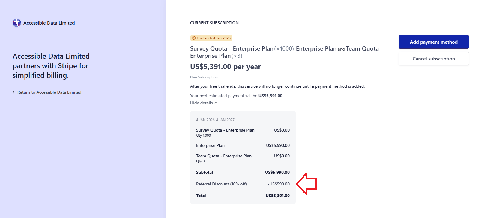

# How does the 'Referral Scheme' work?

I am aware that Accessible Surveys operates a 'Referral Scheme'.  I would like to know how it works and how it can benefit me and any organizations I introduce to Accessible Surveys.

## Why does Accessible Surveys have a 'Referral Scheme'?

We need to let people know we exist.  We have found that our customers are fantastic advocates and frequently introduce us to new organizations.

We want to encourage and reward this.  We have therefore created a paid 'Referral Scheme'.  This creates benefits for referrers and organizations who are referred to us.

## How does the 'Referral Scheme' work?

When you create a customer account, you have access to a 'Referral' page.  

<figure>
  
  <figcaption>The Referral page displays in the left hand navigation menu.</figcaption>
</figure>

From the Referral page, you can access and share your unique referral link.

When someone signs up using your referral link and becomes a paying customer, you both receive rewards.  

- The referred customer receives a **10% discount** for a period of 12 months

- You receive **25% of the total subscription** fee paid for the first 12 months

## How do I know who used my referral link?

Whenever a new customer creates an account using your referral link, you will receive an email notification, like the one shown below.

<figure>
  
  <figcaption>Email notification received when a new customer signs up using your referral link.</figcaption>
</figure>

You will also see a list of all the organizations you have referred, on your 'Referral' page under the heading 'Referral History'.

<figure>
  
  <figcaption>the Referral page shows a list of all the organizations you have referred</figcaption>
</figure>

This part of the application will be further developed, so you have more detailed information about your referrals and rewards payments.

## How do I get paid?

You must have a valid payment method set up on your account under 'Subscription' to receive rewards payments.

This is available in the left hand navigation menu in the Customer Portal as shown below.

<figure>
  
  <figcaption>Subscription page is available in the left hand navigation menu.</figcaption>
</figure>

 Rewards are credited to your account within 30 days of the referred customer's first payment. 

## Do I need to be an organization to be a referrer?

Organizations or individuals can use the referral scheme.  

Referrers just need to have a customer account on Accessible Surveys, with up to date payment details.

## How do organizations I refer to Accessible Surveys receive their discount?

When an organization creates a customer account on Accessible Surveys using your 'Referral Link', they automatically receive a 10% discount for their first 12 months.

<figure>
  
  <figcaption>customer invoice with a 10% 'Referral Discount' applied</figcaption>
</figure>

I hope this answers your questions about the referral scheme.  If you have any questions, please don't hesitate to contact us at help@accessiblesurveys.com
