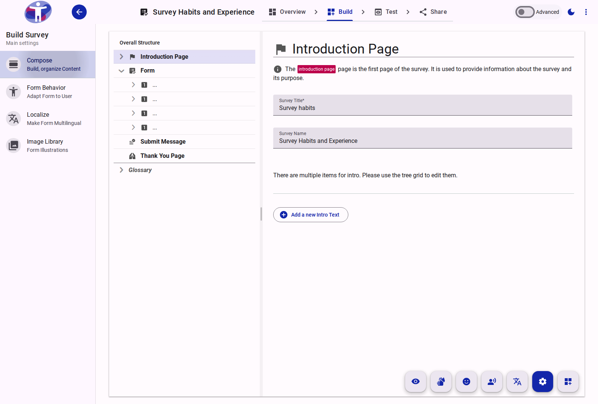

# Building Your Survey

This section covers all aspects of building and customizing your surveys, from adding questions to defining their behavior and appearance.

<figure>
  
  <figcaption>The main interface for building and editing surveys.</figcaption>
</figure>

## Contents

- [Compose](./compose/README.md)
- [Behavior](./behavior/README.md)
- [Image Library](./image-library/README.md)
- [Localize](./localize/README.md)
- [Prompt](./prompt/README.md)
- [Restore](./restore/README.md)
