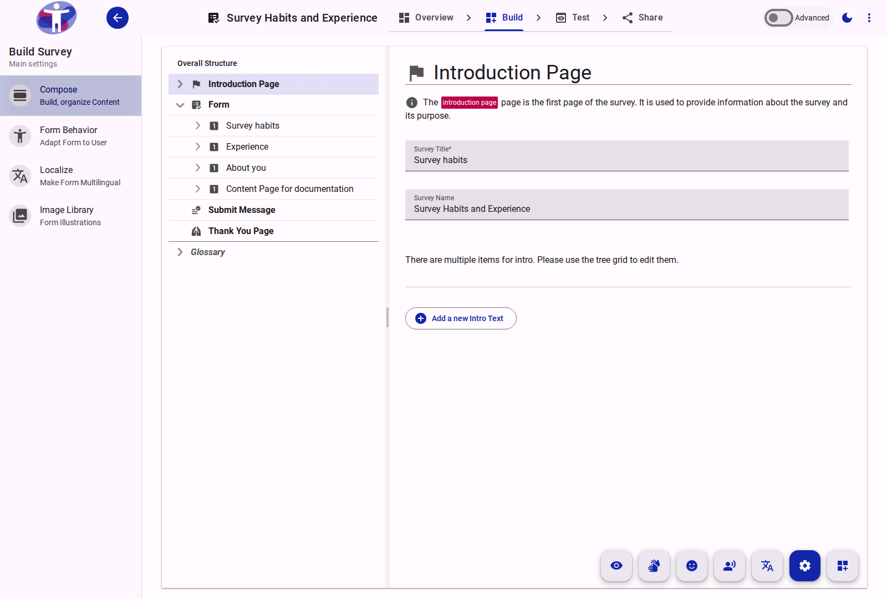

# Composing Your Survey

The compose view is where you build the structure of your survey by adding and organizing questions, pages, and other elements.

<figure>
  -auto.png
  <figcaption>The survey compose view, showing the question tree and editing area.</figcaption>
</figure>

## Contents

- [Text Page](./text-page/README.md)
- [Section](./section/README.md)
- [Question](./question/README.md)
- [Page](./page/README.md)

# Structuring a form


A step by step guide to structuring a form


## Step 1

Click on the 'Form Editor' feild in order to edit it.

<figure><figcaption></figcaption></figure>

## Step 2

The name you gave your form when you created your new survey will appear under both 'name' and 'title'. You can edit both here.

**Name -** This is the name of the form for internal purposes. It is not visible to respondents

**Title -** This appears on the top of your form and is visible to respondents.  You are able to translate your title if your form is multi-lingual

<figure><figcaption></figcaption></figure>

## Step 3

If you have many forms you might want use 'Labels' to organise them.

Labels are explained in a seperate Guidance Note.

## Step 4

The application automatically creates a first page for your form. This appears in the tree structure of your survey on the left side of the screen.

In the example below the first page is named 'About you'.

You have the option to start working on this page or add a new page by selecting the 'add new page' button.

<figure><figcaption></figcaption></figure>

## Step 5

To edit a page, highlight it in the tree structure.

You can ammend the page name and provide a page sub title.  The page sub title is optional.

<figure><figcaption></figcaption></figure>

## Step 6

Pages are organised into sections and question are added to sections. &#x20;


Sections provide additional flexibility when editing forms.  Form logic can be applied to pages, sections and questions and sections can be shared across different forms.


The application automatically creates the first section for your first page. This appears on the tree struture under the first page.

In the example below the first section is named 'first section'

You have the option to start working on this section by clicking on it, or adding a new section by selecting the 'add new section' button.

<figure><figcaption></figcaption></figure>

## Step 7

To edit a section, highlight it in the tree structure

The 'name' is for internal purposes only and won't be seem by survey respondents.

You can give the section a 'title' and 'sub-title' which will appear on your form.&#x20;

The section 'title' will replace the section 'name' in the tree structure as shown in the short video below



## Step 8


Congratulations!  You can now add questions to the section you have created


The Guidance Note '[Adding questions to a form](how-to-add-a-question-to-a-form/)' will show you how to do this.

# Adding questions to a form


All the steps you need to add a questions to a form. This page assumes you have already created a Form and added a Page and Section


## Step 1

Once you have added a Page and Section, selected the 'Add Content' logo in the bottom right of your screen.

<figure><figcaption>
Screenshot showing the 'add content' icon in the bottom right of the screen
</figcaption></figure>

## Step 2

Your screen will look like this:

<figure><figcaption>
Screenshot showing the screen in the 'Add Content Mode'
</figcaption></figure>

## Step 3

The options under 'Form Definition' are explained in separate Guidance Notes.

<figure><figcaption>
Screenshot showing the options under the 'Form Definition' menu
</figcaption></figure>

## Step 4

The second column provides an overview of your Form in a tree structure. You can see the Form Title, Pages, Sections and Questions

<figure><figcaption>
Screenshot showing the form struture in a tree view
</figcaption></figure>

## Step 5

The column on the right hand side shows the different Question types that can be added to the Form

<figure><figcaption>
Screenshot showing the question types that can be added to a form
</figcaption></figure>

## Step 6

Questions are added by dragging and dropping them into the middle section of the Form

<figure><figcaption>
Screenshot showing a 'dropbox' question being added to a form
</figcaption></figure>

## Step 7

The new Question will appear in the Form tree structure in the left hand side of the page

<figure><figcaption>
Screenshot showing the new question appearing in the tree structure
</figcaption></figure>

## Step 8

Selecting the red 'cog' icon beside a Question, enables you to edit the Question

<figure><figcaption>
Screenshot showing the red 'cog' item beside a question
</figcaption></figure>

## Step 8


Congratulations, you can now add questions for your form


There are seperate Guidance Notes covering the main Question types that are available
