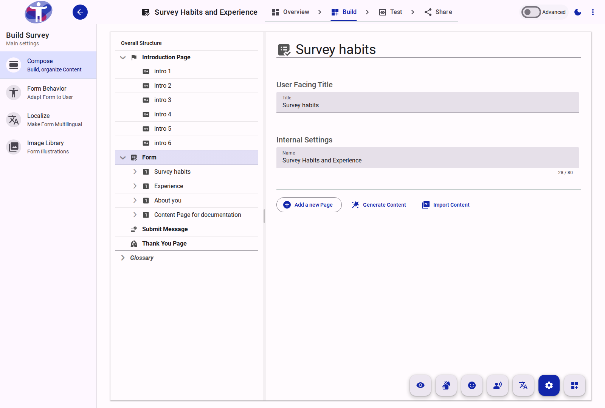

# Form Settings

The Form is the top-level container for your survey. Here you can define the global properties that apply to the entire questionnaire.

<figure>
  
  <figcaption>Survey form settings.</figcaption>
</figure>

## Interface Overview

The **Form Settings** panel allows you to define the identity of your survey.

- **Name**: The internal name for your form. This is used for administrative purposes and is not visible to respondents.
- **Title**: The public-facing title of the survey. This appears at the top of every page and is what respondents will see.
- **Subtitle**: An optional description or welcome message displayed below the title.

## Contents

This folder contains assets for the survey form section.
