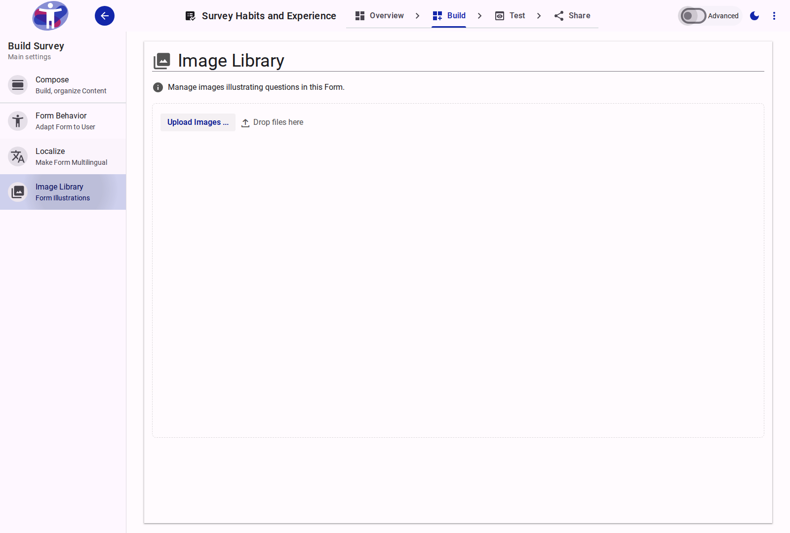

# Image Library

The image library is where you can upload, store, and manage all the images you use in your surveys.

<figure>
  -auto.png
  <figcaption>The survey image library.</figcaption>
</figure>

## Contents

This folder contains assets for the image library section.
