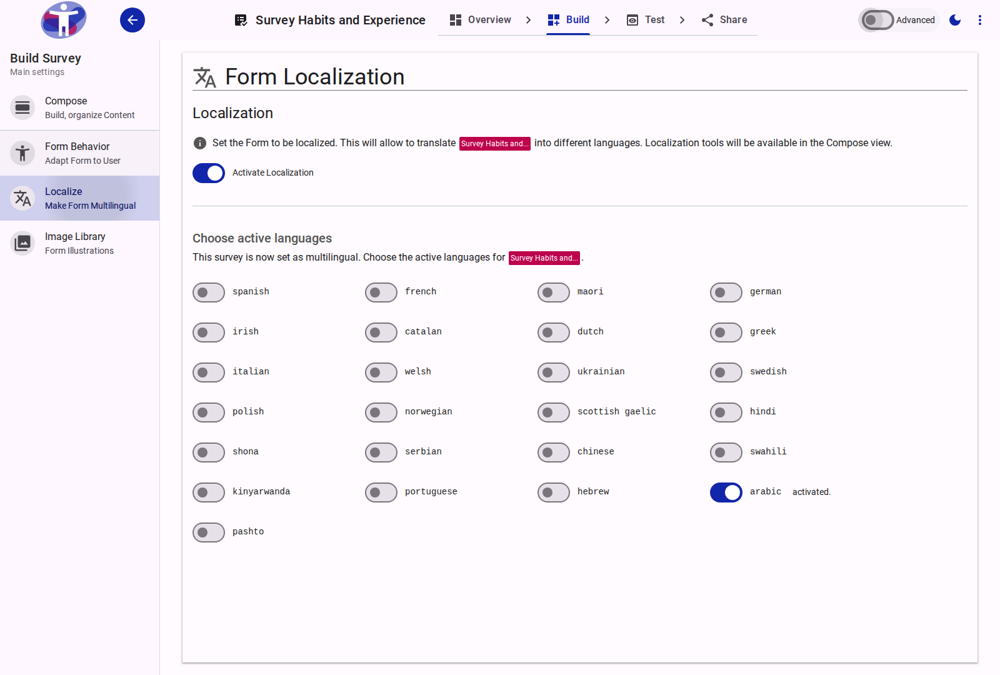

# Localize Survey

The localization feature allows you to provide your survey in multiple languages, making it accessible to a wider audience.

<figure>
  -auto.png
  <figcaption>The survey localization interface.</figcaption>
</figure>

## Contents

This folder contains assets for the survey localization section.
