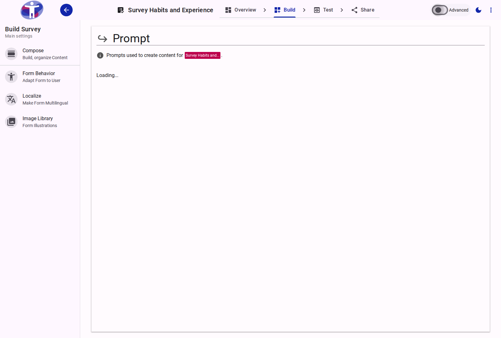

# Survey Prompts

Prompts provide additional information or instructions for your survey questions, helping respondents understand what is being asked.

<figure>
  -auto.png
  <figcaption>The survey prompt editor.</figcaption>
</figure>

## Contents

This folder contains assets for the survey prompt section.
