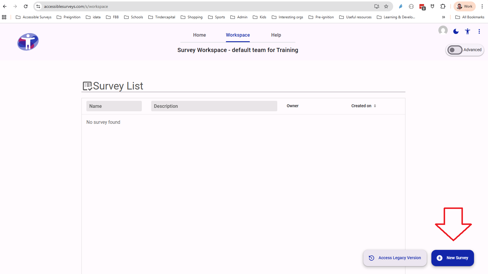
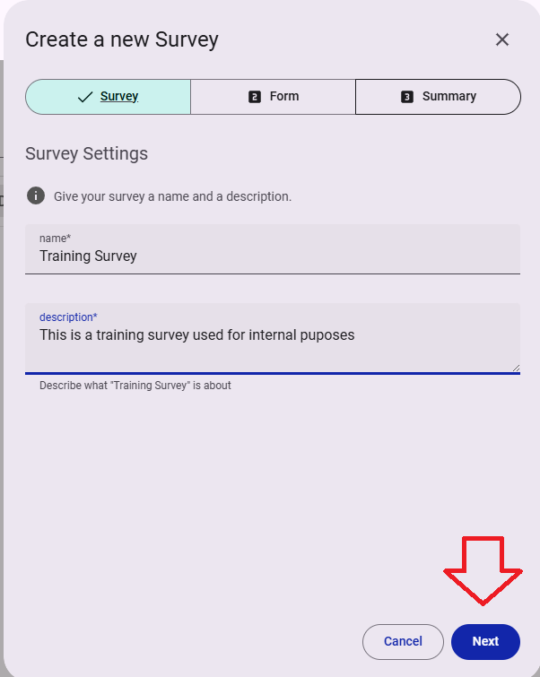
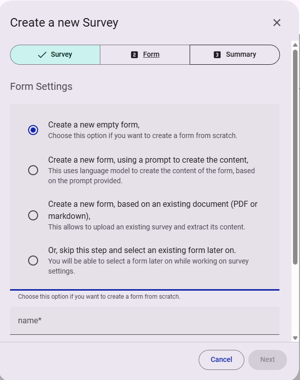
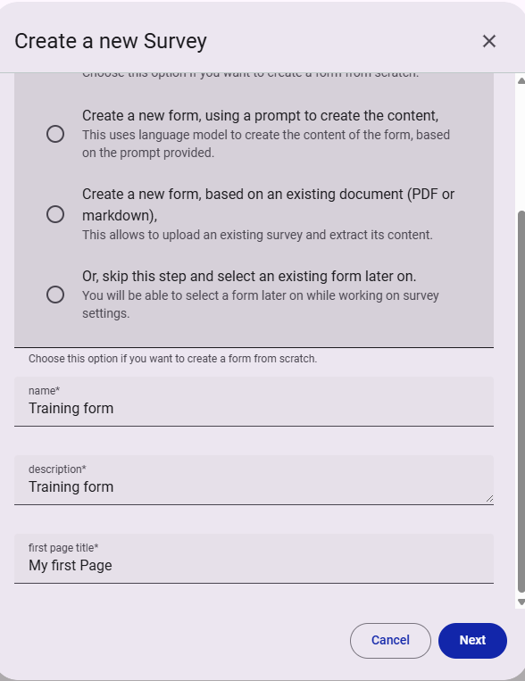
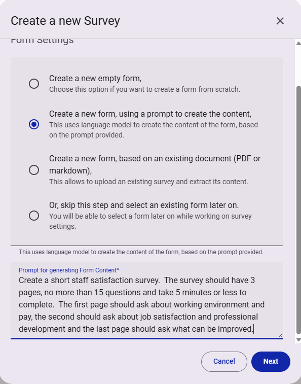

# Creating a new survey


A step by step guide to creating a new survey


## Step 1

Select the blue 'New Survey' button at the bottom right of your survey workspace

<figure>
  
  <figcaption>Select 'New Survey' to begin creating a new survey.</figcaption>
</figure>

## Step 2

Give your survey a 'Name' and 'Description'. Then select 'next'

<figure>
  
  <figcaption>Give your survey a name and description.</figcaption>
</figure>


You will not be able to move to the next step until the survey has a name and description.


## Step 3

Surveys use 'Forms' to collect data.

<figure>
  
  <figcaption>Screenshot showing four different ways to create a form.</figcaption>
</figure>

There are 4 ways to create a form:

1. **Create a new empty form** - Build a form from scratch using a powerful form builder

2. **Create a new form, using a prompt to create the content** - Create a new form using AI prompts to generate content which can be reviewed and edited

3. **Create a new form, based on an existing document** - If you have your questions in a document, you can save that document as a PDF or markdown file and upload it.  The questions and form structure will be imported annd can be reviewed and edited.

4. **Skip this step and use a form you have created previously** - You will be able to select a form that has been created previously.


For an indepth demonstration of the different options available to create a form, refer to the Masterclass 'Creating a Form'.


## Step 4

If you selected 'Create a new empty form' you will be asked to give the form a name and description.

<figure>
  
  <figcaption>Give your form a name and description.</figcaption>
</figure>


The next button will not be enabled until the form has a name and description.


## Step 5

If you selected 'Create a new form, using a prompt to create the content', you can use AI prompts to generate the content for your form.

<figure>
  
  <figcaption>Use AI prompts to generate the content for your form.</figcaption>
</figure>

In this example the following prompt has been used:

"Create a short staff satisfaction survey.  The survey should have 3 pages, no more than 15 questions and take 5 minutes or less to complete.  The first page should ask about working environment and pay, the second should ask about job satisfaction and professional development and the last page should ask what can be improved."


Why don't you try creating a survey using this prompt?  It will take some time to process, but it will give you a good idea of how the AI prompts work.


## Step 6

If you selected 'Create a new form, based on an existing document', you will see an option to upload a file.  This can be a PDF or markdown file.

<figure>
  
  <figcaption>Option to upload a file.</figcaption>
</figure>

The questions and form structure will be imported and can be reviewed and edited.


The maximum file size is 2MB.  Larger documents can be split into multiple files and uploaded one at a time.


## Step 7

If you selected 'Skip this step and select an existing form later on', you can proceed to the next step.  

## Step 8

Whichever option you selected, when you select 'Next' you will be taken to a summary page.

You will be asked to confirm that you want to create the survey.

<figure>
  
  <figcaption>Option to cancel or confirm the creation of the survey.</figcaption>
</figure>


Congratulations you have successfully created a new survey. The Guidance Notes 'Editing a Survey' will show you how to build it out.

