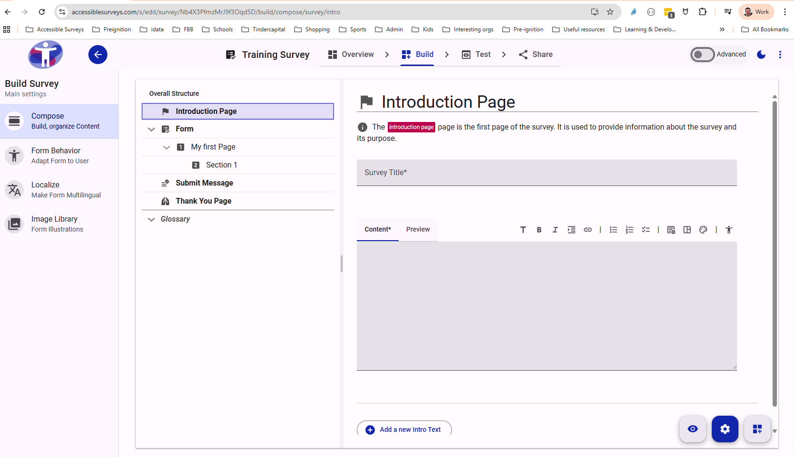

# Survey Builder Interface

The Survey Builder interface allows you to accomplish all the tasks needed to create, test and share your survey.

## Interface Overview

The screenshot below shows the main areas of the Survey Builder interface:

<figure>
  
  <figcaption>Survey Builder Interface</figcaption>
</figure>

The interface is divided into the following main areas:

### 1. Survey Structure (Left Sidebar)

This panel displays the hierarchical structure of your survey. It shows:

* **Pages**: The top-level containers for your survey content.
* **Sections**: Logical groupings of questions within a page.
* **Questions**: The individual items that respondents will interact with.

You can use this area to navigate between different parts of your survey and reorder items by dragging and dropping them.

### 2. Form Editor (Center Canvas)

This is the main working area where you build your form. Here you can:

* View the layout of your questions.
* Select items to edit their properties.
* Add new content using the 'Add' buttons.

### 3. Properties Panel (Right Sidebar)

When you select an item in the Form Editor or Survey Structure, its settings will appear in this panel. Depending on what is selected, you can configure:

* **Question Text**: The actual question asked.
* **Response Options**: Choices for multiple-choice questions.
* **Validation**: Rules for required answers or specific formats.
* **Logic**: Conditions for showing or hiding the question.

### 4. Toolbar (Top)

The toolbar provides access to high-level actions and tools, such as:

* **Preview**: See how your survey will look to respondents.
* **Save**: Save your current changes.
* **Settings**: Access general survey settings.
