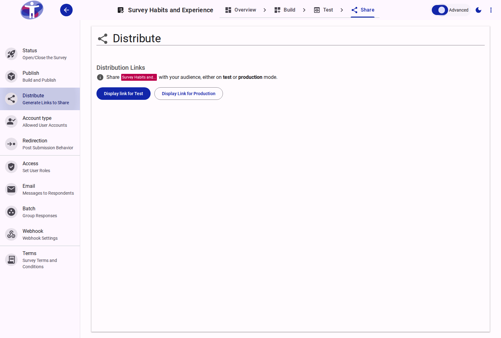

# Advanced Distribution Settings

Optimize how your survey reaches your audience with advanced distribution tools.

<figure>
  
  <figcaption>Advanced distribution settings.</figcaption>
</figure>

## Custom Links and Tracking

Create custom tracking links to monitor the performance of different distribution channels (e.g., social media vs. newsletter). You can also configure domain masking to serve the survey from your own branded domain.
