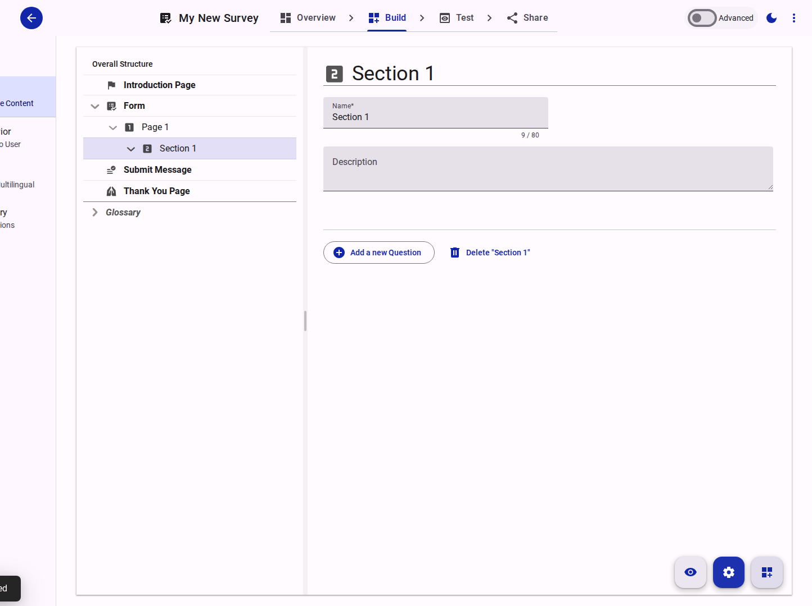
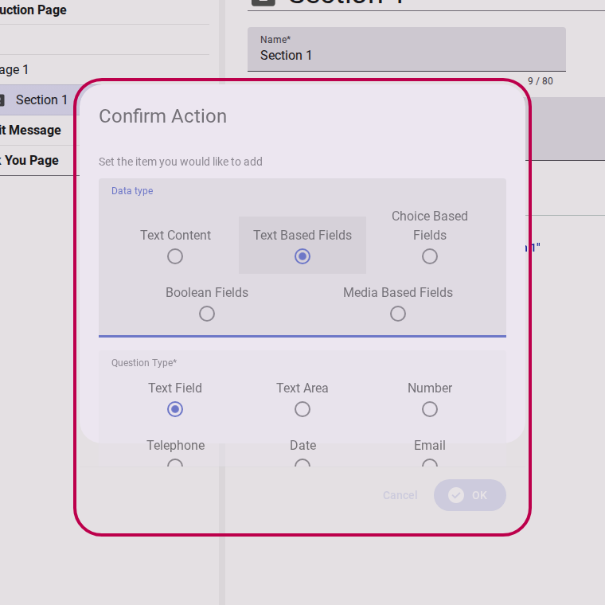

# Adding content to a form

Once you have set up the structure of your form (Pages and Sections), you can start adding questions and content.

## Step 1: Navigate to the Section

In the Survey Editor, locate the Section where you want to add a question using the tree grid. Double-click the Section to open its properties.

<figure>
  
  <figcaption>Open the section properties</figcaption>
</figure>

## Step 2: Add a new Question

In the section properties panel, click the **Add a new Question** button.

<figure>
  
  <figcaption>Click add new question</figcaption>
</figure>

A confirmation dialog will appear, asking you to choose the type of question you want to add (e.g., text, choice, rating).

<figure>
  
  <figcaption>Select question type</figcaption>
</figure>

Select the desired question type and click **OK**.

<figure>
  
  <figcaption>Confirm question selection</figcaption>
</figure>

Your new question is now added to the section. You can proceed to edit its label, description, and specific settings.
