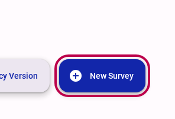
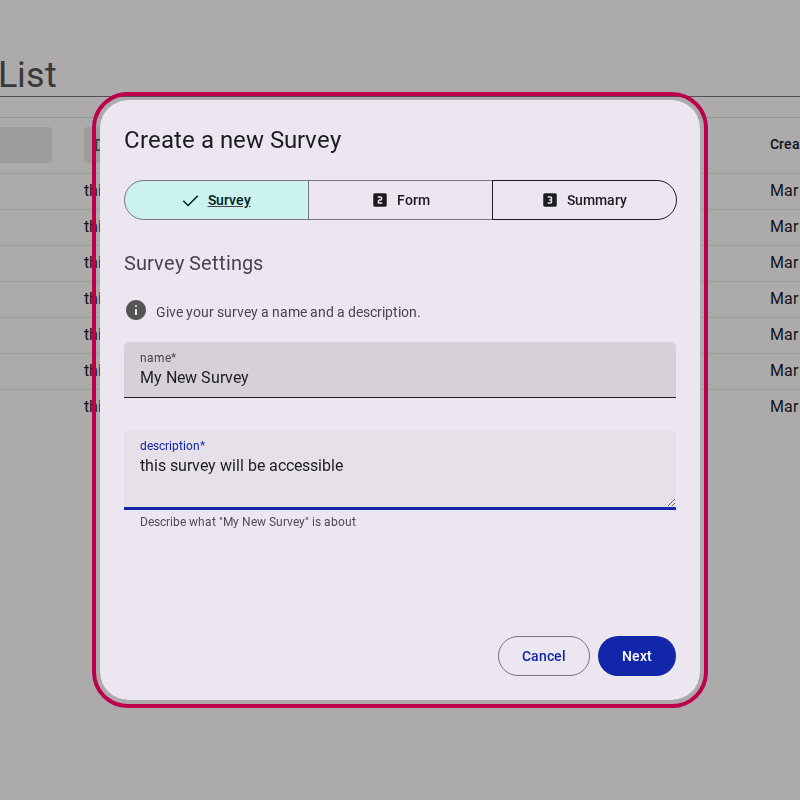
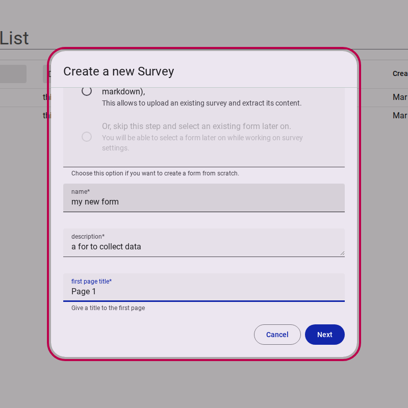
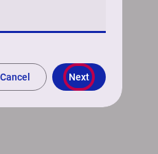
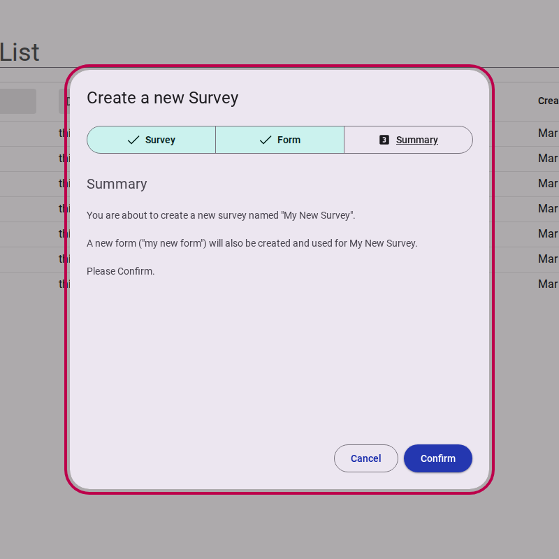

# Creating a new survey


A step by step guide to creating a new survey


## Step 1: Start the creation process

Select **New Survey** on your survey workspace.

<figure>
  
  <figcaption>Click new survey button</figcaption>
</figure>

## Step 2: Provide survey details

Give your survey a **Name** and a brief **Description**. 

<figure>
  
  <figcaption>Fill in name and description</figcaption>
</figure>


You will not be able to move to the next step until the survey has a name and description.


Then, select **Next**.

<figure>
  
  <figcaption>Press next button</figcaption>
</figure>

## Step 3: Choose or create a form

Surveys use 'Forms' to collect data.

You can create a new form right away by providing a name, description, and first page title.

<figure>
  
  <figcaption>Choose type of form</figcaption>
</figure>

If you already have a form that you want to use in your survey, you can choose to select an existing form instead. 

Fill in the necessary form details.

<figure>
  
  <figcaption>Fill in form details</figcaption>
</figure>

Then, select **Next**.

<figure>
  
  <figcaption>Press next button</figcaption>
</figure>

## Step 4: Review and Confirm

On the summary page, you will be asked to confirm your choices and verify that you want to create the new survey with these settings.

<figure>
  
  <figcaption>Review survey details</figcaption>
</figure>

Click **Confirm**.

<figure>
  
  <figcaption>Press confirm button</figcaption>
</figure>


Congratulations, you have successfully created a new survey! You will now be redirected to the survey editor.

