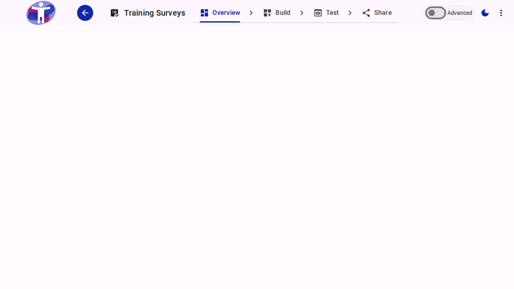

# Analytics

The Analytics dashboard provides a visual overview of your survey's responses and performance metrics.

<figure><figcaption>Survey Analytics Dashboard</figcaption></figure>

From this dashboard, you can:

- Monitor the number of responses over time.
- View completion rates and drop-off points.
- Analyze respondent demographics.

# Introduction to survey analytics


Survey analytics provides an visual overview of the response to a survey. It updates in real time and allows users to filter their dataset based on criteria they define, eg show responses by date, location or based on answers to a specific question.

Data can be exported to a specialist platform for in-depth statistical analysis


## Step 1

The 'Analytics' feild shows recent activity on the survey's active batch.

Clicking on this feild takes you into survey analytics

<figure><figcaption></figcaption></figure>

## Step 2

The main analytics page is divided into two sections:

**Meta feilds:** This contains survey information which is not related to the survey reponses themselves. This includes information such as when a response was received, the language it was submitted in or where the respondent was located. Fields in this section stay stable when a user navigates through different pages of the survey

**Pages:** This contains the responses to the survey questions themselves. You will see the page structure of your survey on the left hand side under the heading 'Pages'. You can use the page structure to naviage through your survey.

<figure><figcaption></figcaption></figure>

## Step 3

The elements on the analytics dashboard are interactive. Meaning feilds in both the meta and page sections act both as a visualization tool, with charts displaying its distribution over the dataset, and as a filtering tool.

This provides a simple yet extremely powerful tool to interact with collected data, and instantaneously visualize the sub-dataset according to users' own criteria (like, how does data look for for Africa, or for just for users answering `yes` to question `X`, or any combination of available information), just by clicking on categories of the chart.

We used an advanced ordering algorithm for exploring large multivariate datasets in the browser. It will support extremely fast (<30ms) interaction with coordinated views, even with datasets containing millions of records.

In the example below we can look at responses from India, who submitted their survey in Hindi and answered 'Yes' to the question 'Do you consider yourself to be a person with a disability'



## Step 4

Filters can be cleared by clicking on the filter option on in the 'details' feild or under the feild where the filter has been applied

<figure><figcaption></figcaption></figure>

## Step 5

Feilds from the 'Pages' section can be pinned to the top section of the page. This means that they remain visible as you scroll through the survey and are readily available to filter the dataset.

Feild can be unpinned at any time.



## Step 6

Each feild can be viewed as a chart or as raw data

|  (1) (1) (1) (1) (1) (1) (1) (1) (1) (1) (1) (1) (1).png>) |  (6).png>) |
| ------------------------------------------------------------------------------------------------- | ------------------------------------------------- |

## Step 7

In the future you will be able to customise the chart type, colours and positioning

# Exporting Survey Data


If you export data from the platform, you are responsible for the privacy of the exported data. Exported data must be treated in line with relevant data protection regulations such as GDPR



Exporting your data from the platform is a sensitive action.  You need to have the necessary user rights and have signed into your account recently in order to export survey data.  If you get an error message it means that you don't have the necessary rights or you need to sign out of your account and sign in again and try again.


## Step 1

From the analytics page, click on the three lines beside the survey name in the top menu

This will expand the view and display the 'download' symbol



## Step 2

A privacy warning window will be activated, reminding you of your data protection and data privacy responsibilities.

You will need to tick the box confirming that you understand these responsibilitis before you can export survey data

.png>)

## Step 4

There are various options for to chose from when exporting survey data

.png>)

## Step 5

First select the data form that you want to export your data in. There are two choices:

**json**- JavaScript Object Notation (JSON) is a standard text-based format for representing structured data based on JavaScript object syntax. It is commonly used for transmitting data in web applications (e.g., sending some data from the server to the client, so it can be displayed on a web page, or vice versa)

**CSV**- A CSV is a comma-separated values file, which allows data to be saved in a tabular format. CSVs look like a spreadsheet but with a . csv extension. CSV files can be used with most any spreadsheet program, such as Microsoft Excel or Google Spreadsheets

## Step 6

Next select the type of data that you would like to export. There are three choices:

**Anonymized**- Provides the option of exporting an anonymized data set. MetaData and all feilds marked as 'private' on your form will not be exported. This is a great option for protecting personal data as long as you have marked all questions which ask for personal data as private

**Raw-** Provides the option of exporting all the data that has been collected against a survey, including MetaData and all response feilds. Great care should be taken with this sort of data.

**Humanized**- Similar to raw data, but with transalated responses and question lookups added

## Step 7

Once you have decided how you want to export the survey data, select 'Export Now'

.png>)

## Step 8

The data will start downloading automatically

.png>)
