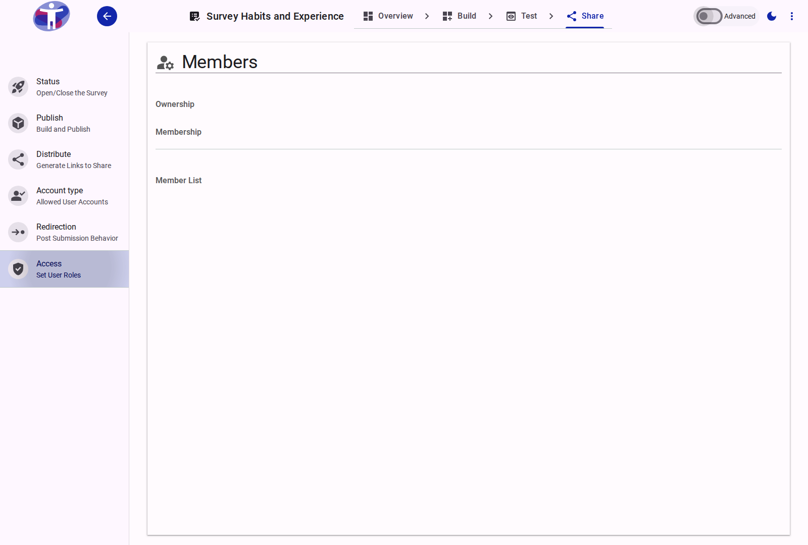
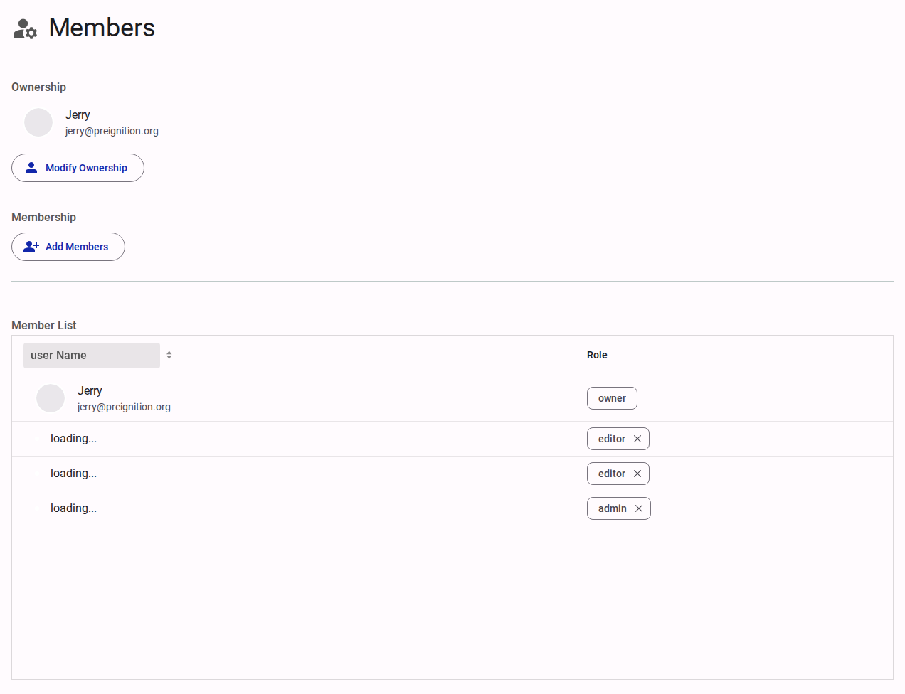

# Survey Access

The **Access** settings page allows you to govern internal team permissions, specifying who is authorized to view, edit, or manage the survey architecture.

<figure>
  
  <figcaption>The survey access settings interface</figcaption>
</figure>

## Interface Overview

<figure>
  
  <figcaption>Access settings content</figcaption>
</figure>

The **Access** configuration defines which internal users from your organization have rights over this specific survey. The user who creates the survey is automatically designated as the default "Survey Owner."

Users can be assigned one of the following four roles:

- **Owner**: Possesses full administrative rights over the survey. The Owner can modify the survey's ownership, delete the survey entirely, and grant or revoke access for all other users.
- **Editor**: Possesses comprehensive rights to build and configure the survey content and its settings, but cannot alter the survey's ownership or manage user roles.
- **Viewer**: Granted read-only access to view the survey structure and its analytic results. Viewers cannot edit content or manage users.
- **Translator**: Granted access to view the survey and permission specifically to edit translations for a designated language. Translators cannot alter the core structure, manage users, or change settings.

To add or transfer rights, the target user must already possess an active account affiliated with your organization.

## Advanced Settings

For detailed permission scopes, creating custom roles, and segmenting data access, refer to the [Advanced Access Settings](./advanced.md).
