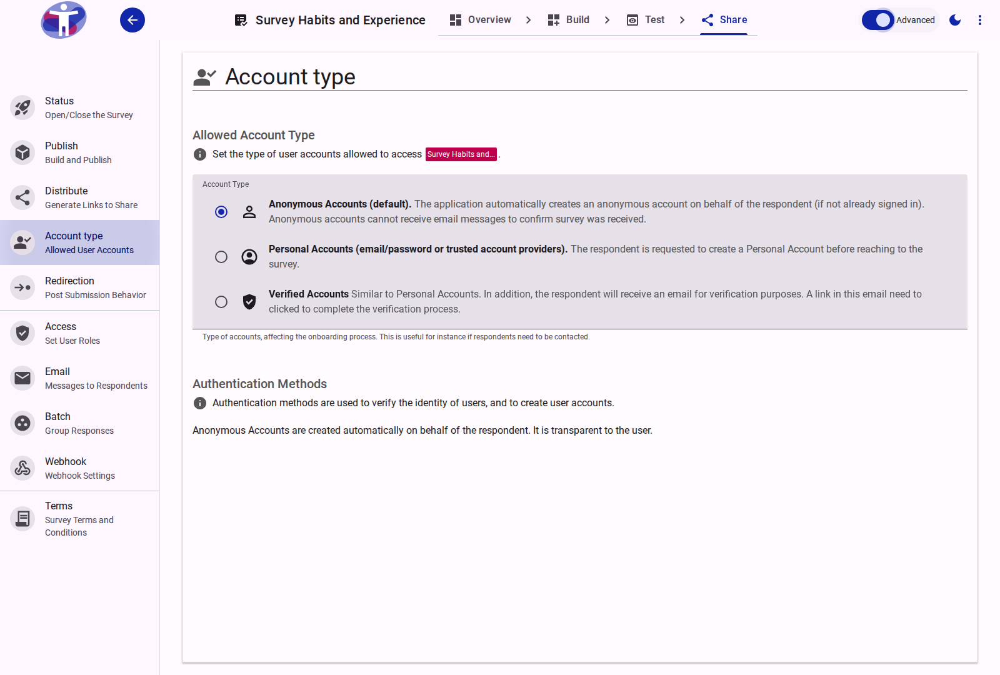
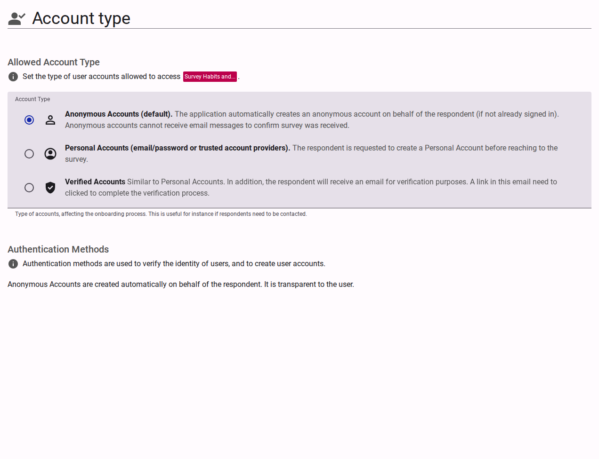

# Advanced Account Settings

Configure detailed authentication requirements for your respondents.

<figure>
  
  <figcaption>Advanced account type settings.</figcaption>
</figure>

## Authentication Providers

Advanced settings enable integration with third-party identity providers (SSO) or the configuration of multi-factor authentication for verified users, ensuring the highest level of security for your survey data.

<figure>
  
  <figcaption>account-type advanced content</figcaption>
</figure>
