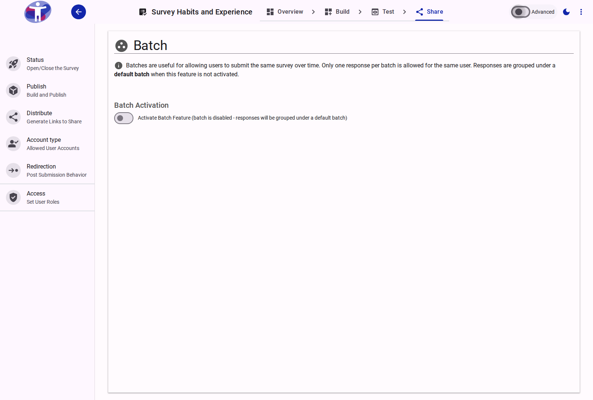

# Survey Batches

The **Batches** page allows you to schedule distinct periods of availability for your survey, making it easy to orchestrate longitudinal data collection.

<figure>
  
  <figcaption>The survey batches interface</figcaption>
</figure>

## Interface Overview

<figure>
  
  <figcaption>Batch settings content</figcaption>
</figure>

The **Batches** configuration defines exact temporal windows for your survey's operation. A survey must be attached to an active batch in order to accept incoming responses.

- **Batch List**: A master index displaying all registered batches alongside their identifying labels, start/end boundaries, and operational status (Active, Scheduled, or Closed).
- **Batch Creation & Management**: Select "Create New Batch" to establish a new time block. Modifying a batch requires entering the following criteria:
    - **Name & Description**: A descriptive title and optional text to organize and easily identify the batch (e.g., "Q1 2024 Global Survey").
    - **Start Date (From Date)**: The precise timestamp when the survey opens. If this date is set in the past, the batch evaluates as immediately live.
    - **End Date (To Date)**: The timestamp when the survey systematically closes. If omitted, the survey remains open indefinitely until manually closed or superseded.

*Note: Grouping respondents via batches natively separates collected answers in the Analytics dashboard, which is ideal for isolating and comparing results generated in different time periods.*

## Advanced Settings

For configuring automated API triggers and recurring batch creation cycles, examine the [Advanced Batch Settings](./advanced.md).
