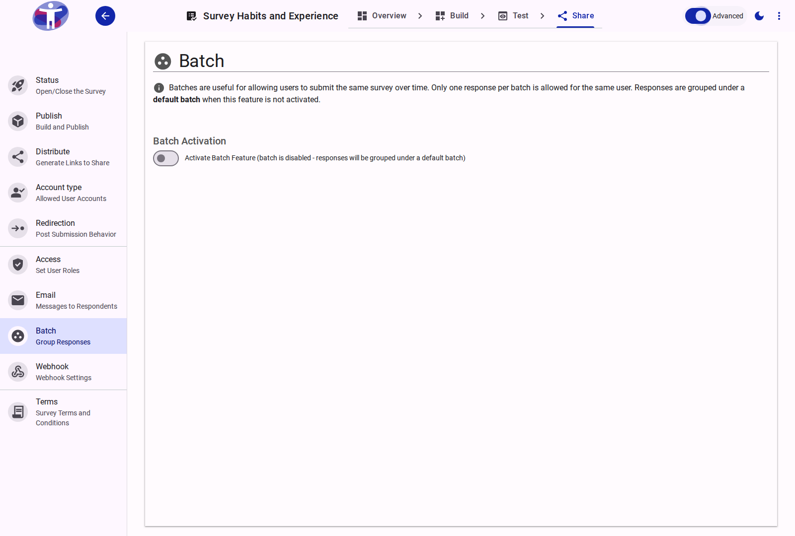
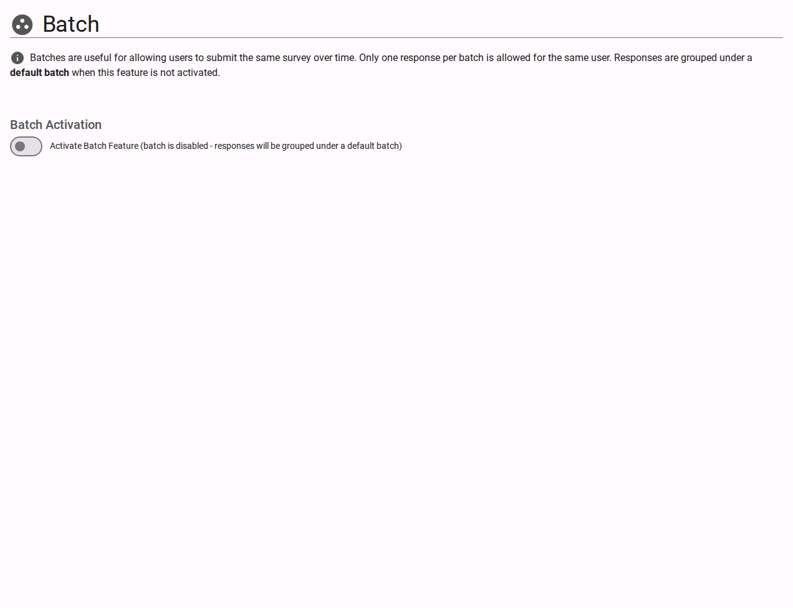

# Advanced Batch Settings

Fine-tune how your survey batches behave and interact with other system components.

<figure>
  
  <figcaption>Advanced batch settings.</figcaption>
</figure>

## Automated Scheduling

Use advanced batch settings to set up recurring batches (e.g., daily, weekly) or to trigger batch activation based on external events via API, allowing for fully automated survey cycles.

<figure>
  
  <figcaption>batch advanced content</figcaption>
</figure>
