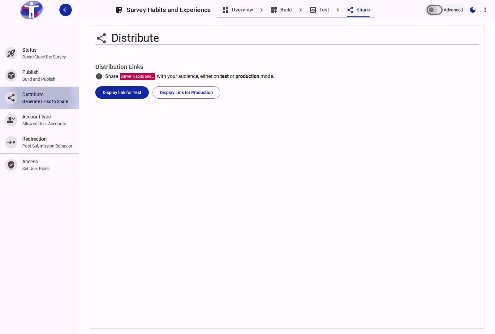
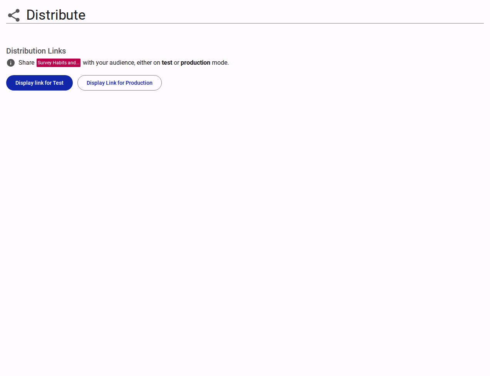

# Distribute Your Survey

The **Distribute** page provides the tools and settings necessary to generate and manage access links for your survey.

<figure>
  
  <figcaption>The survey distribution interface</figcaption>
</figure>

## Interface Overview

<figure>
  
  <figcaption>Distribution settings content</figcaption>
</figure>

The **Distribute** page allows you to generate custom links to share via email, chat, social media, or your own website. 

- **Survey Mode**: Select the operational mode for the generated link.
    - **Production**: Links intended for real respondents. Answers submitted via these links are automatically saved to the database.
    - **Test**: Links intended for previewing and testing the survey before it goes live. Answers submitted via test links are **not** saved to the database.
- **Survey Name / Alias**: Choose the base path for your URL. You can use the default cryptic survey identifier or an "alias" (a more readable, customized link text).
- **Survey Options**: Configuration toggles that vary depending on whether the survey is in test or production mode (e.g., forcing respondents to use the latest version of the survey, displaying a landing page).
- **Accessibility Modes**: Generate a link that automatically activates a specific accessibility mode (e.g., Read Aloud, Easy Read, Sign Language) when a respondent clicks on it.
- **Survey Link & QR Code**: View and copy the generated link or download a QR code corresponding to the link configuration.

## Advanced Settings

For custom tracking, domain masking, and creating alias survey links, see the [Advanced Distribution Settings](./advanced.md).
