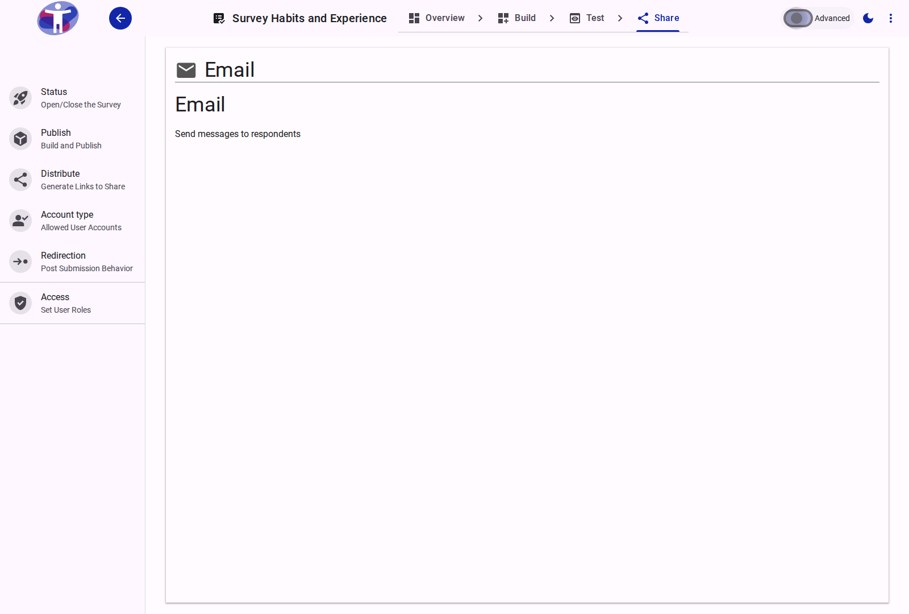
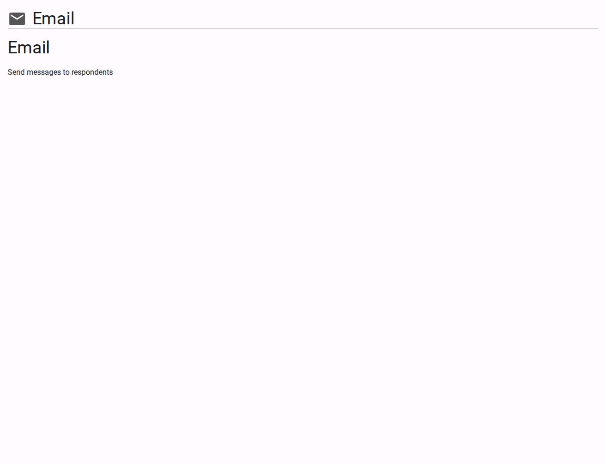

# Email Your Survey

The **Email** page allows you to compose and dispatch survey invitations directly to respondents from within the platform.

<figure>
  
  <figcaption>The survey email invitation interface</figcaption>
</figure>

## Interface Overview

<figure>
  
  <figcaption>Email settings content</figcaption>
</figure>

The **Email** configuration manages the built-in email distribution workflow.

- **Recipients List**: Define your target audience by manually entering email addresses, importing a structured CSV file, or selecting an existing contact list.
- **Message Editor**: Contains the interface for drafting your invitation.
    - **Subject**: The subject line for your email invitation.
    - **Body**: A rich text field for composing your message. You can format the text, hyperlink content, and attach images.
    - **Dynamic Placeholders**: Incorporate template tags (e.g., `{{survey_link}}`, `{{first_name}}`) to automatically personalize individual emails, ensuring each recipient receives their distinct trackable survey link.
- **Delivery Options**: Execute the delivery immediately or schedule the broadcast for a specified future date and time.

## Advanced Settings

For SMTP integration, bounce management, and advanced deliverability rules, review the [Advanced Email Settings](./advanced.md).
