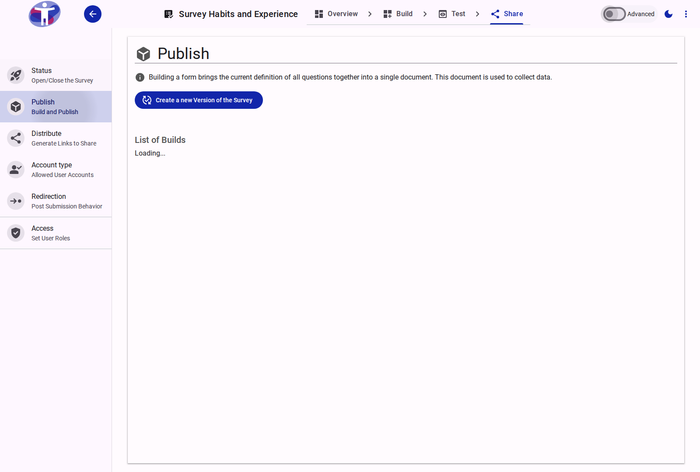
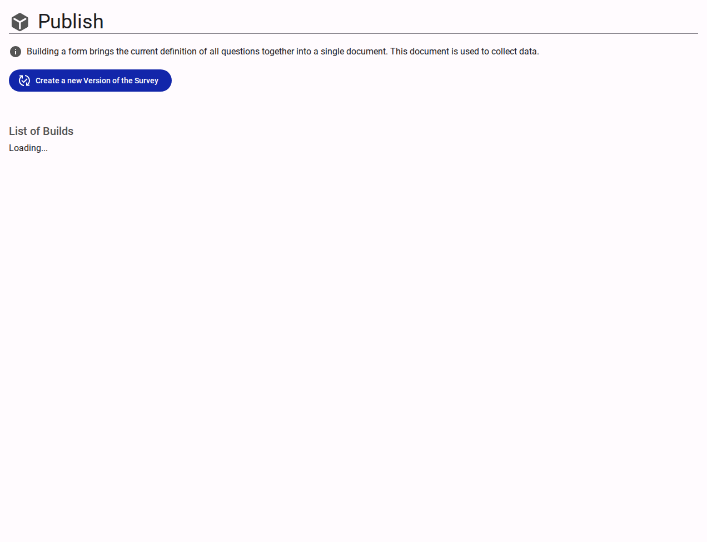

# Publish Your Survey

The **Publish** page allows you to make your latest survey changes live for respondents and manage the history of your survey versions.

<figure>
  
  <figcaption>The survey publishing interface</figcaption>
</figure>

## Interface Overview

<figure>
  
  <figcaption>Publish settings content</figcaption>
</figure>

The **Publish** page is the final step in making your survey live or applying new changes.

- **Publish Button**: Click this button to make your latest changes available to respondents. Any changes made to your survey (or the underlying form) must be "published" before they become effective.
- **Unpublish**: A survey can be unpublished at any time, which deactivates it so that it can no longer collect responses.
- **Version History**: A table listing all previously published versions of your survey, including:
    - **Version**: The designated version label or number.
    - **Date**: When this specific version was published.
    - **Published By**: The user who initiated the publish action.
    - **Status**: Indicates which version is the currently active one.
- **Rollback**: Options are provided to revert or rollback to a previously published version if needed.

## Advanced Settings

For version control and rollback features, see the [Advanced Publishing Settings](./advanced.md).
