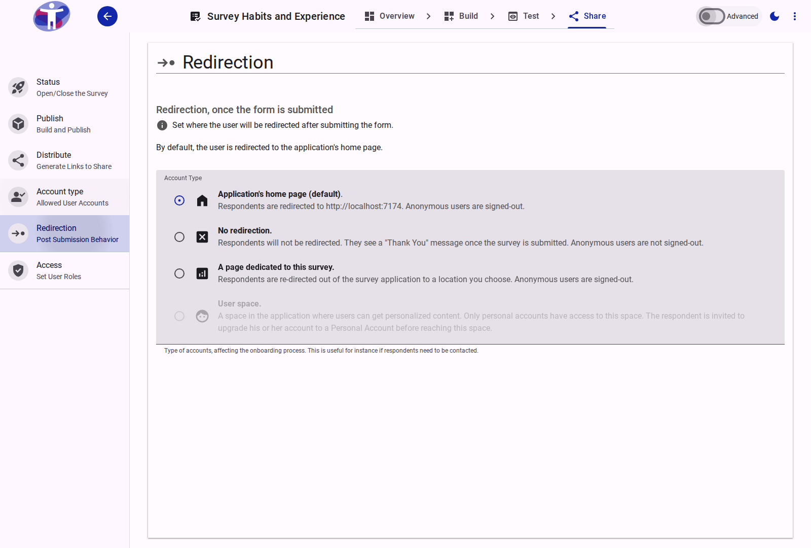

# Survey Redirection

Redirect respondents to a thank-you page, your website, or any other URL after they submit their survey.

<figure>
  
  <figcaption>The survey redirection settings page.</figcaption>
</figure>

## Interface Overview

The **Redirection** page controls where respondents are sent after they complete your survey.

- **Redirection Options**:
    - **Custom URL**: Redirect respondents to a specific webpage, such as your company website or a special landing page. Enter the full URL in the provided field.
    - **Thank You Page**: Display a standard "Thank You" message within the survey app. You can customize the text of this message.
    - **Home Page**: Redirect respondents back to the main survey portal or home page.
- **Auto-Redirect**: Enable this to automatically redirect users after a few seconds, or leave it disabled to require them to click a "Continue" button.

## Advanced Settings

For conditional redirection logic, refer to [Advanced Redirection Settings](./advanced.md).

## Contents

This folder contains assets for the survey redirection section.

# Redirection after completing survey

## Step 1

Under the 'Distribute' heading in the 'Survey Definition' menu you will see the heading 'Redirection'

This allows you to set where a respondent willl be redirected to after completing the survey.

<figure><figcaption></figcaption></figure>

## Step 2

**User Space:** This is the default option for users who are signed in using Personal or Verified accounts. Upon completing the survey, repondents will be taken to a space in the app where they can get personalized content, such as thank you messages, links to reports coming out of the survey or invitations to participate in new surveys. Users completing the survey with an anonymous account will be invited to upgrade ther account to to Personal Account before reaching this space

**Application's home page:** This will either be accessiblesurveys.com or your own homepage if you are using an entreprise version of the app.

**A page dedicated to the survey:** This feature is not yet implemented. The idea is to have a page where respondents could access useful information about the survey, eg number of responses, how responses will be used etc.
