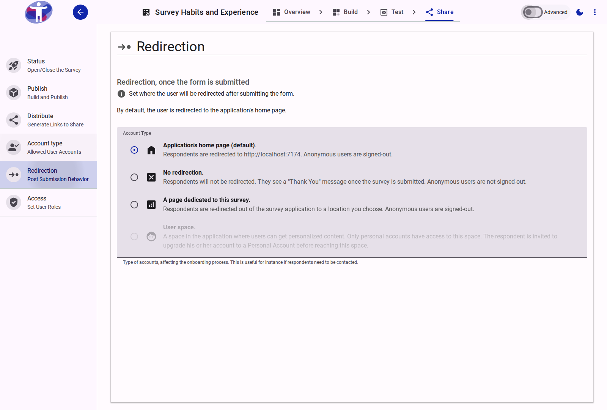
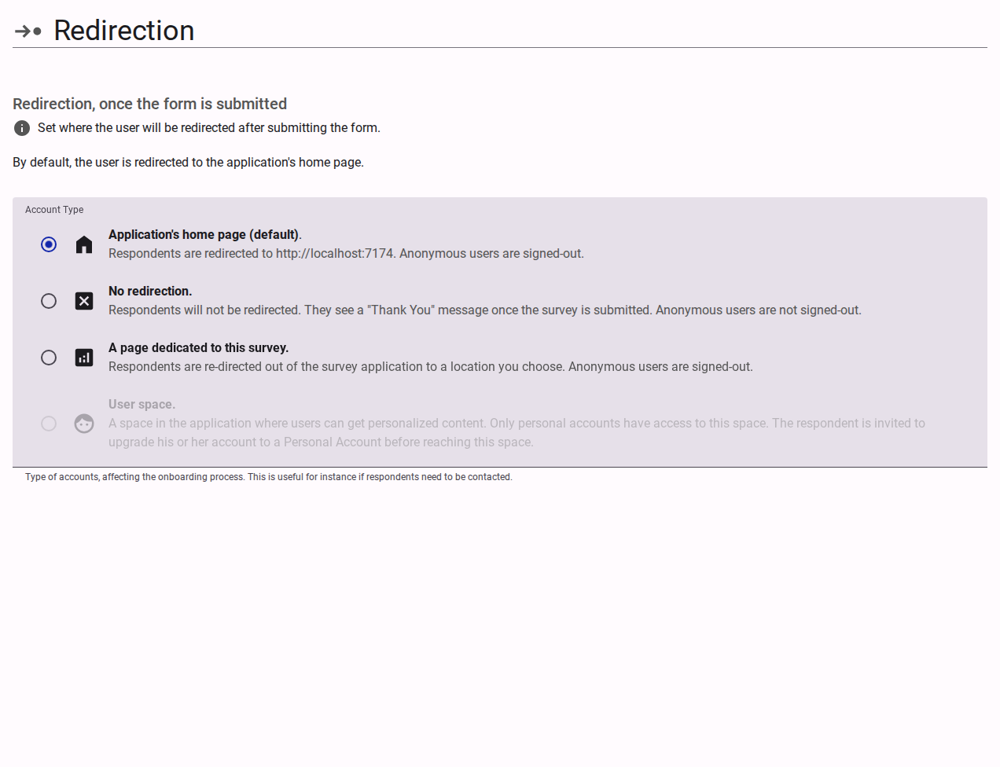

# Survey Redirection

The **Redirection** page determines where respondents are routed immediately after they submit their completed survey.

<figure>
  
  <figcaption>The survey redirection interface</figcaption>
</figure>

## Interface Overview

<figure>
  
  <figcaption>Redirection settings content</figcaption>
</figure>

The **Redirection** settings control the post-submission journey. The following destinations can be configured:

- **User Space (Default)**: Respondents are taken to a personalized space within the app. For Personal or Verified accounts, they can see customized thank you messages, links to resulting reports, or invitations for new surveys. Anonymous users are invited to upgrade their account before reaching this space.
- **Application's Home Page**: Respondents are redirected back to the main portal (either `accessiblesurveys.com` or your organization's custom enterprise homepage).
- **Custom URL**: Redirect respondents to an external, customized web page, such as your company's main website.
- **Thank You Page**: Display a standard, customizable "Thank You" message directly within the survey environment.

## Advanced Settings

For conditional redirection logic based on user behavior or answers, refer to the [Advanced Redirection Settings](./advanced.md).
