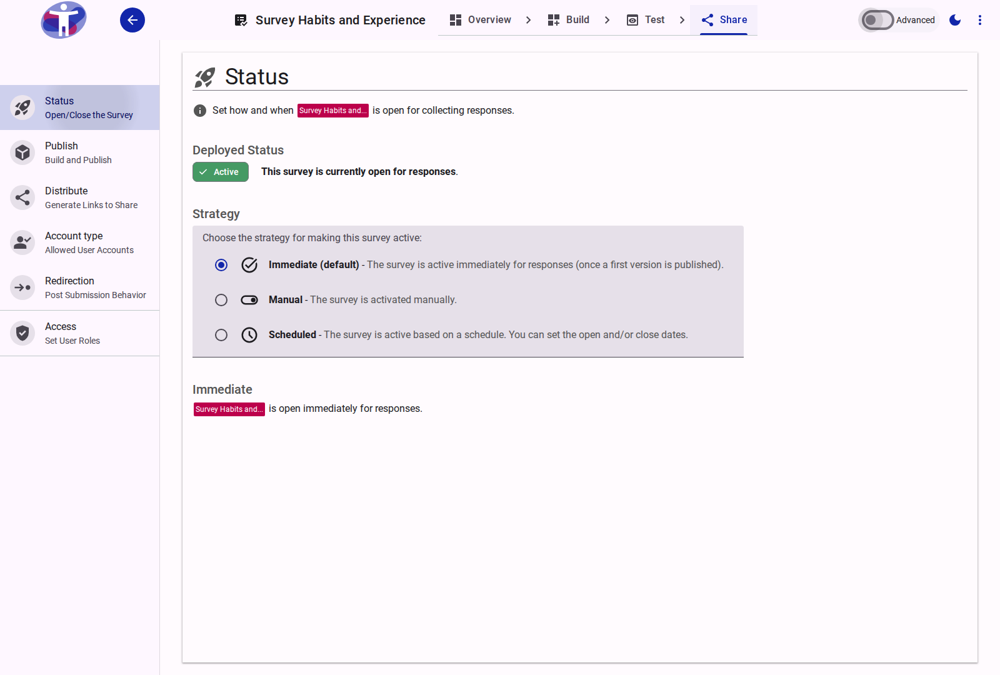
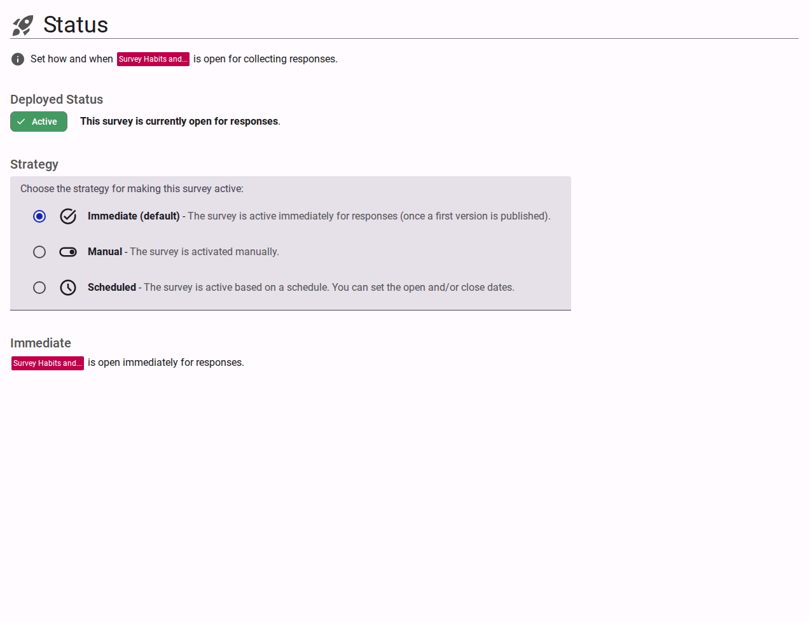

# Survey Status

The **Status** page provides information on the current operational state of your survey and allows you to configure its activation strategy.

<figure>
  
  <figcaption>The survey status page.</figcaption>
</figure>

## Interface Overview

<figure>
  
  <figcaption>Status settings content.</figcaption>
</figure>

The **Status** page allows you to set how and when your survey is open for collecting responses.

- **Deployed Status**: Displays the current status of the survey (e.g., "Active"). It indicates whether the survey is currently open for responses.
- **Strategy**: Defines the mechanism used to make the survey active. The available strategies are:
    - **Immediate (default)**: The survey is active immediately for responses once a first version is published.
    - **Manual**: The survey is activated manually by toggling its status.
    - **Scheduled**: The survey is active based on a schedule. You can set specific open and/or close dates.

## Advanced Settings

For detailed status metrics and advanced configurations, refer to the [Advanced Status Settings](./advanced.md).
