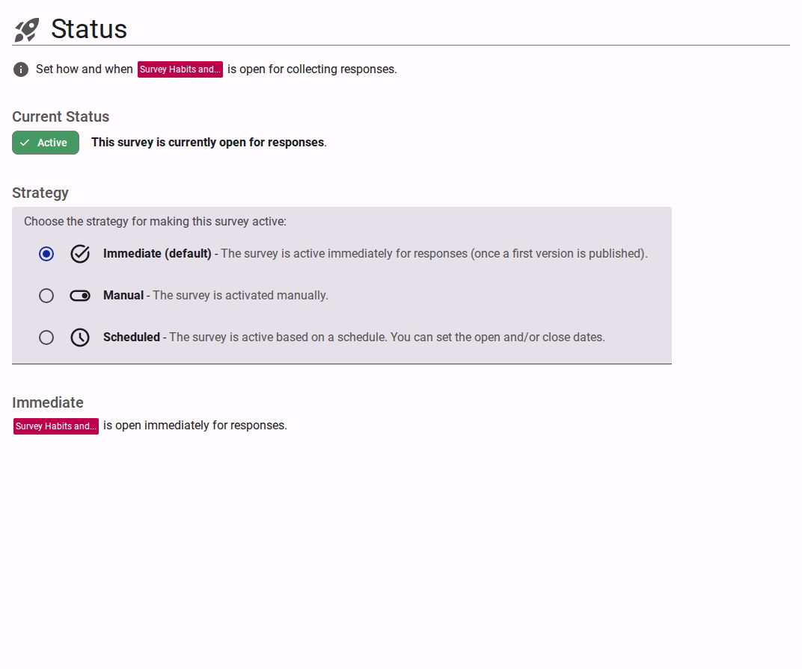

# Sharing Your Survey

This section explains the different methods for sharing your survey and managing how respondents can access it.

<figure>
  
  <figcaption>The survey sharing options page.</figcaption>
</figure>

## Contents

- [Status](./status/README.md)
- [Publish](./publish/README.md)
- [Distribute](./distribute/README.md)
- [Account Type](./account/README.md)
- [Redirection](./redirection/README.md)
- [Access](./access/README.md)
- [Email](./message/README.md)
- [Batch](./batch/README.md)
- [Webhooks](./webhooks/README.md)
- [Terms](./terms/README.md)
