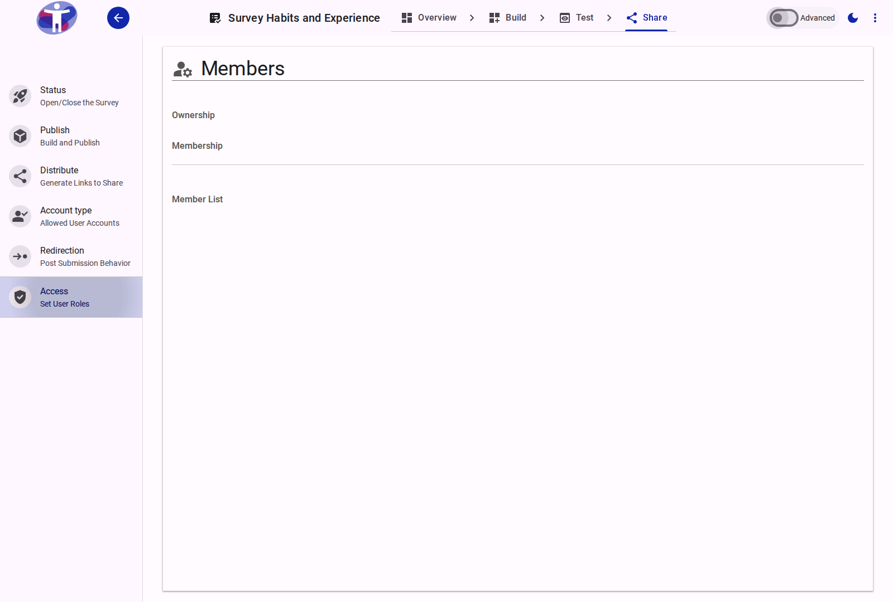

# Survey Access

Control who can take your survey by setting access permissions. You can make your survey public, private, or available only to specific users.

<figure>
  
  <figcaption>The survey access settings page.</figcaption>
</figure>

## Interface Overview

The **Access Settings** page allows you to manage who can view and edit your survey.

- **User List**: The main table displays all users currently associated with the survey, showing their name, email, and current role.
- **Add User**: Use the "Add User" button to invite new collaborators. You will need to enter their email address and select a role.
- **Roles**:
    - **Owner**: Full control, including deleting the survey and managing other users.
    - **Editor**: Can edit the survey content and settings but cannot manage users.
    - **Viewer**: Read-only access to the survey and results.
    - **Translator**: Can only access the translation interface.

## Contents

This folder contains assets for the survey access section.

# Survey access rights


The access tab enables you to define ownership and user rights for a particular survey so any changes to the survey are made by authorised users


## Step 1

* The 'access' tab appears under the 'Survey Definition' menu and shows the existing user roles for the survey
* The person who created the survey will be the default 'Survey Owner'

<figure><figcaption></figcaption></figure>

## Step 2

* To change the survey owner select 'modify ownership'
* Select the user you want to transfer ownership to
* The user must already have an account on the app which is associated with your organisation

 (1).png>)

## Step 3

* It is possible to add users to the survey with different levels of user rights
* Again, the user must already have an account on the app which is associate with your organisation

 (1) (1) (1).png>)

## Step 4

* User rights can be revoked at any time by users with a high level of authorisation
* This is done by double-clicking on the user and selecting the option to revoke the user

 (1) (1) (1) (1).png>)

## Step 5

There are 4 different types of survey users:

**Owner**- Has full rights on the survey. Can modify ownership of the survey or add or revoke all other users

**Editor**- Has full rights on the survey. Can not modify ownership

**Viewer**- Has rights to view the survey. Can not add or revoke other users

**Translator**- Has the rights to view the survey and edit the survey in a specified language. Can not add or revoke other users.

# Access rights for forms


Only the forms 'Owner' can set user rights to the form. In order to be given rights, a user must have an account on the application and be associated with your program.


## Step 1

The user who creates the form is by default the forms 'Owner'.  Only 'Owners' can control who has access to edit, view and translate their forms.

Go to 'Access' in the left hand menu and select 'Add Users'

Choose the user you want to add and specify the role you would like them to have.

They will then appear in the 'User List' at the bottom of the page&#x20;



## Step 2

It is possible for a form 'Owner' to assign their ownership rights to another user.  This works in a similar way to adding a new user.


