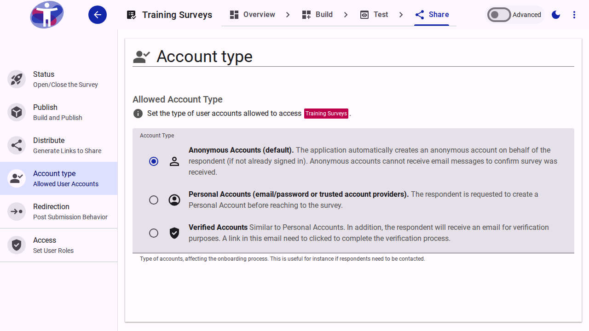

# Account Type

Define which types of user accounts are required to access your survey, such as anonymous users, registered users, or specific user groups.

<figure><figcaption>Survey Account Type Settings</figcaption></figure>
