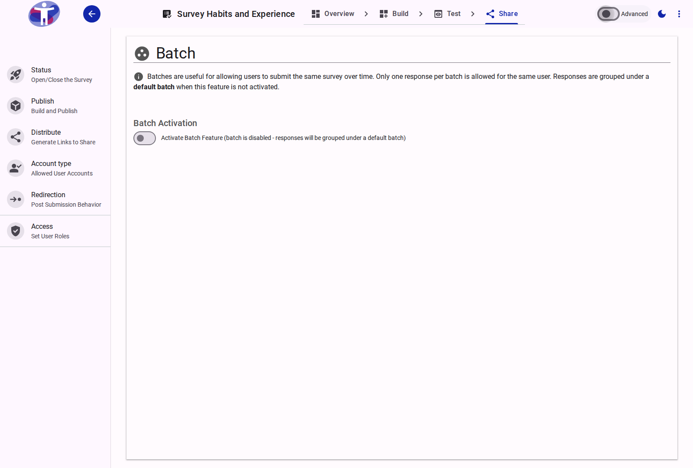

# Survey Batches

Batches allow you to send your survey to a large list of respondents simultaneously, making it easy to manage large-scale survey distribution.

<figure>
  
  <figcaption>The survey batches page.</figcaption>
</figure>

## Contents

This folder contains assets for the survey batches section.
