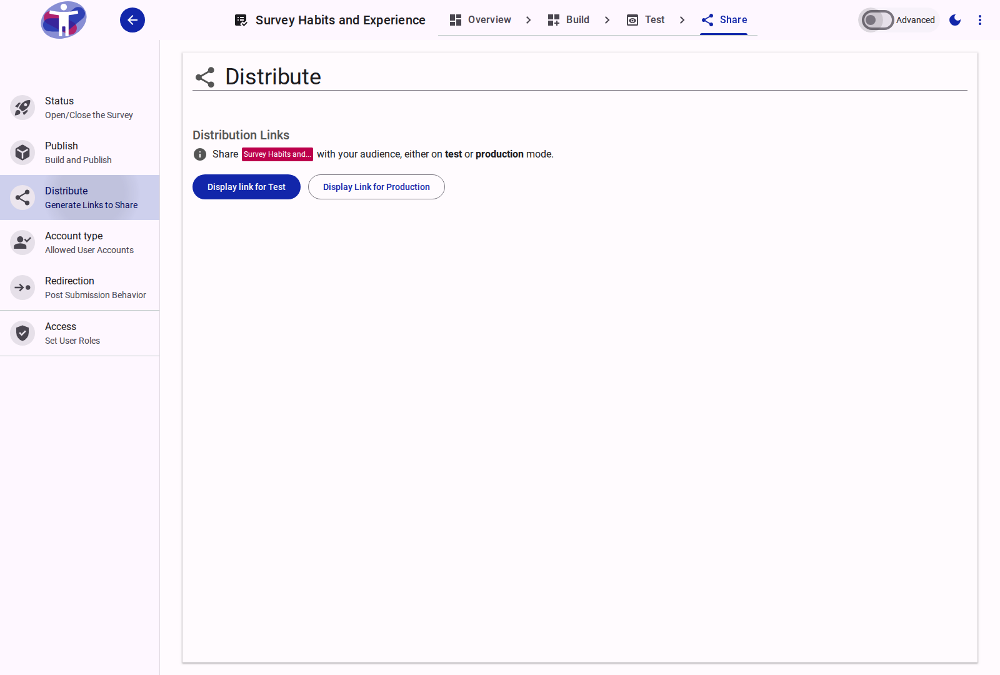

# Distribute Your Survey

Learn about the various methods for distributing your survey, including sharing links, sending emails, and embedding it on your website.

<figure>
  
  <figcaption>The survey distribution options page.</figcaption>
</figure>

## Interface Overview

The **Distribute** page provides the tools you need to get your survey in front of respondents.

- **Survey Link**: The primary URL for your survey. You can copy this link to share via email, chat, or social media.
- **QR Code**: A generated QR code that links directly to your survey. Download this image to include on printed materials like posters or flyers.
- **Social Share**: Quick links to share your survey directly to platforms like Facebook, Twitter, and LinkedIn.
- **Embed Code**: An HTML snippet that allows you to embed the survey directly into your own website or blog.

## Contents

This folder contains assets for the survey distribution section.
