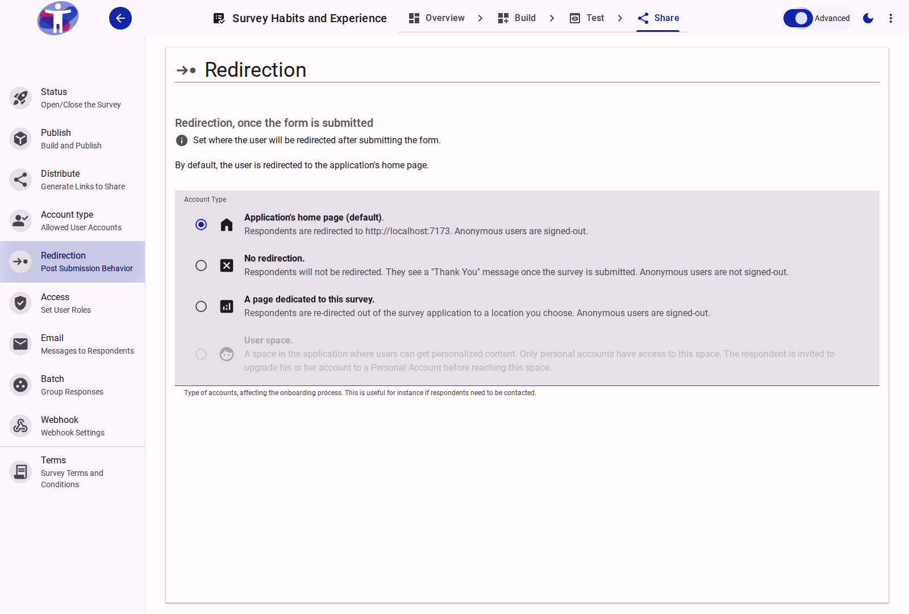

# Advanced Redirection Settings

Configure complex redirection logic based on respondent behavior.

<figure>
  
  <figcaption>Advanced redirection settings.</figcaption>
</figure>

## Conditional Redirection

Instead of a single destination, use advanced settings to define rules that redirect respondents to different URLs based on their answers or score. This is ideal for A/B testing or personalized post-survey journeys.
