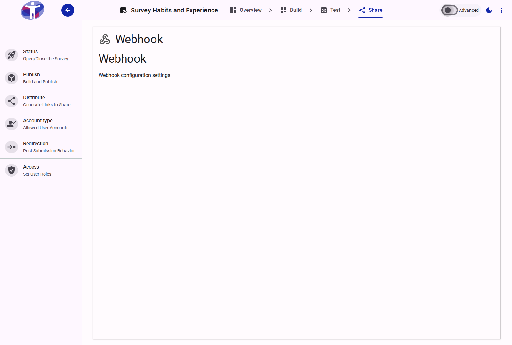

# Survey Webhooks

Webhooks allow you to send real-time data from your survey to other applications, enabling powerful integrations and automations.

<figure>
  
  <figcaption>The survey webhooks configuration page.</figcaption>
</figure>

## Interface Overview

The **Webhooks** page enables real-time integration with external systems.

- **Webhook List**: Shows all active webhooks.
- **Add Webhook**: Click to configure a new integration.
- **Configuration Fields**:
    - **Payload URL**: The destination URL where the data will be sent (POST request).
    - **Secret**: A shared secret key to verify the authenticity of the payload.
    - **Trigger Events**: Select when the webhook should fire (e.g., "Response Completed", "Response Updated").
    - **Status**: Toggle to enable or disable the webhook without deleting it.

## Advanced Settings

For custom headers and retry policies, refer to [Advanced Webhook Settings](./advanced.md).

## Contents

This folder contains assets for the survey webhooks section.
