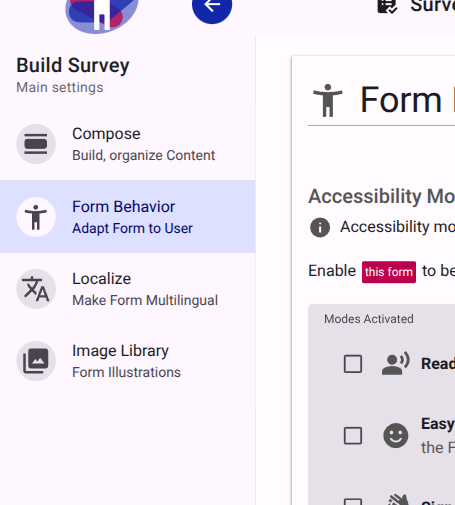
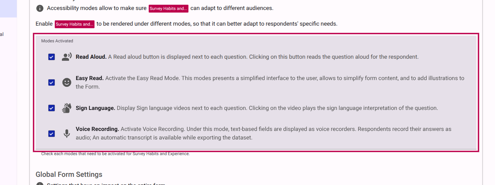

# Activating Accessibility Modes

This guide will show you how to enable different accessibility modes, such as Read Aloud, Easy Read, Sign Language, and Voice Recording, so your respondents can take the survey in the way that best suits them.

### Step 1: Navigate to Form Behavior

While in the **Build Survey** view, look at the main settings menu on the left side of the screen. Click on the **Form Behavior** option.

<figure><figcaption>Click on Form Behavior in the Build Survey menu.</figcaption></figure>

### Step 2: Enable Accessibility Modes

In the **Form Behavior** settings, look for the **Accessibility Modes** section. Here you will find a list of available modes that you can activate for this form. Check the boxes next to the modes you want to enable.

The available modes include:

- **Read Aloud**: Displays a button next to each question that, when clicked, reads the question aloud to the respondent.
- **Easy Read**: Presents a simplified interface to the user, allowing you to simplify form content and add illustrations.
- **Sign Language**: Displays sign language videos next to each question. Clicking the video plays the sign language interpretation.
- **Voice Recording**: Allows text-based fields to be displayed as voice recorders, so respondents can record their answers as audio. An automatic transcript is available when exporting the dataset.

<figure><figcaption>Check the boxes for the accessibility modes you wish to activate.</figcaption></figure>

### Step 3: Toggle Between Accessibility Modes in Compose Mode

Once you have activated the desired accessibility modes, go back to the **Compose** mode in the left menu. You will now be able to toggle between the different accessibility modes you activated to adjust your survey's content and appearance for each specific mode.
