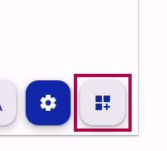
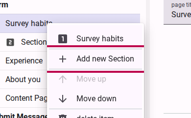
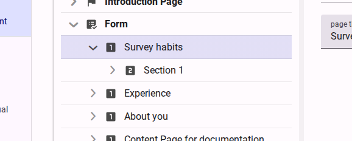
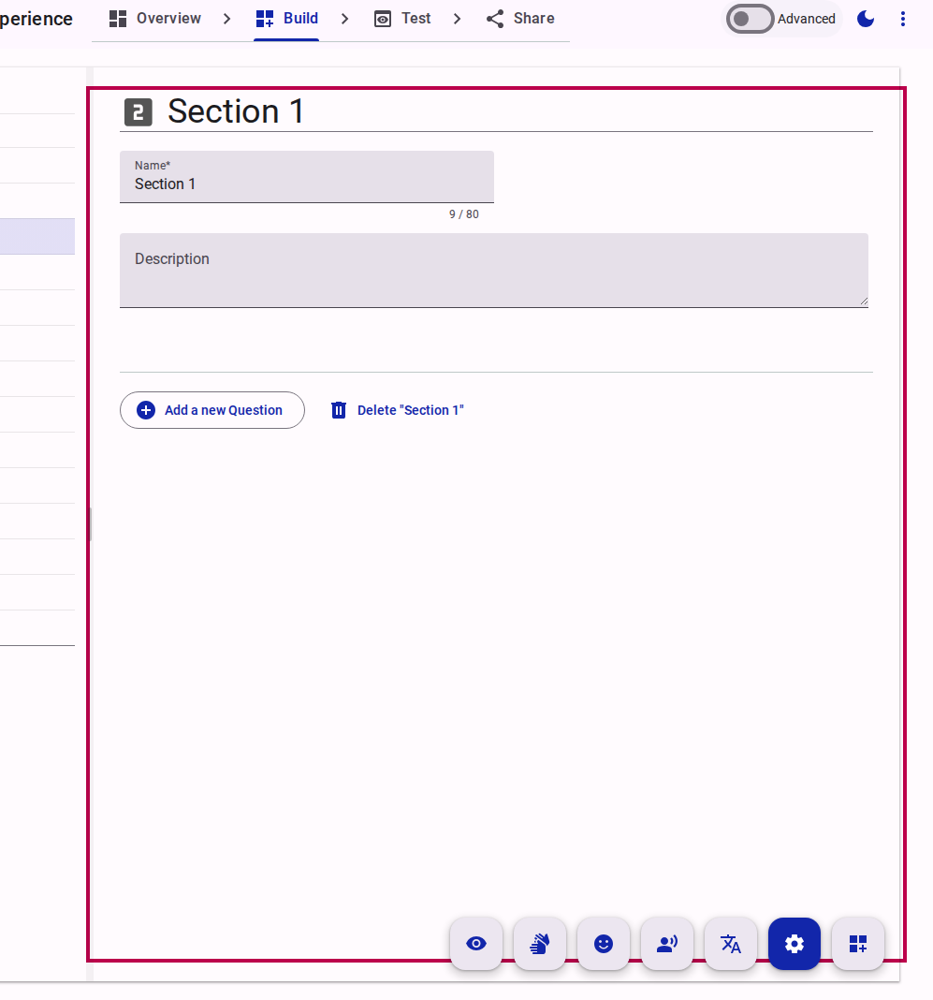
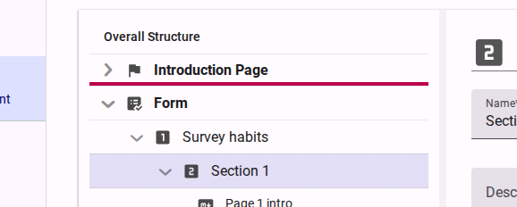
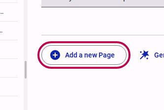
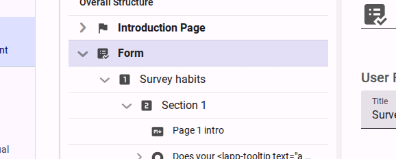
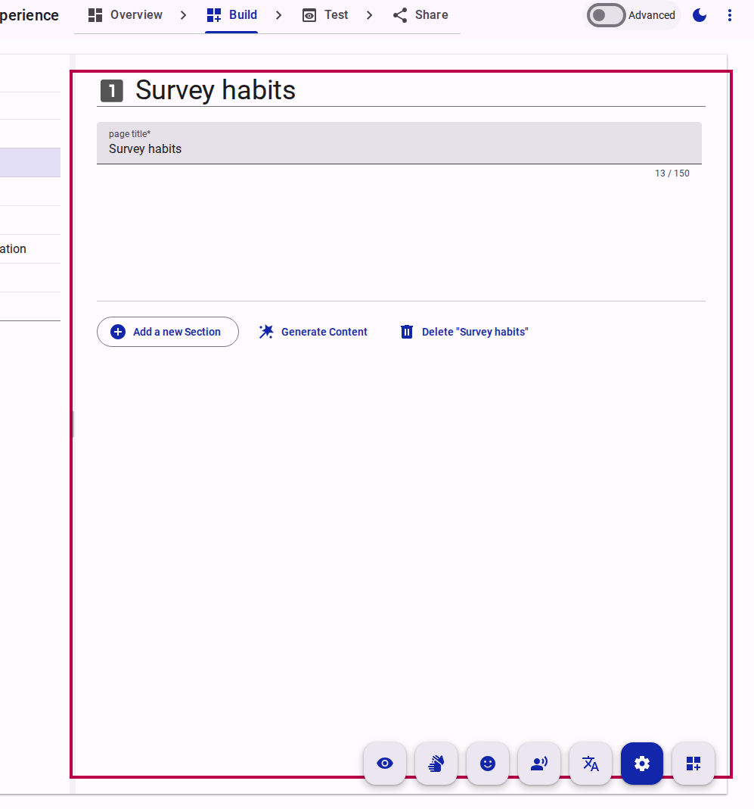

# Adding content to a form

Accessible Surveys provides three distinct methods for adding content (Pages, Sections, and Questions) to your form, depending on your preferred workflow.

## Option A: Using "Add Content" Mode (Visual)

This mode provides a visual, drag-and-drop interface for building your form.

### Step 1: Activate Add Content Mode

In the Compose view, locate and click the **Add Content Mode** button in the top toolbar.

<figure><figcaption>Activate Add Content Mode to enable drag-and-drop building.</figcaption></figure>

### Step 2: Drag and Drop

Once activated, you can drag question types from the left panel directly onto your form canvas to insert them exactly where you want them.

<figure><figcaption>Drag and drop question types onto the form canvas.</figcaption></figure>

## Option B: Using the Tree View Context Menu (Structural)

The Tree View (left pane) allows you to precisely insert new structural elements exactly where you need them.

### Step 1: Right-Click in the Tree View

Find the parent element where you want to add content (e.g., a Page if you want to add a Section). Right-click on it to open the context menu and select the "Add new..." option.

<figure><figcaption>Right-click an element in the Tree View to add child content.</figcaption></figure>

### Step 2: Configure the New Content

Once added, the new element will appear in the Tree View. Click on it to open its properties in the right pane, where you can set its name, label, and other details.

<figure><figcaption>Select the newly added item in the Tree View.</figcaption></figure>
<figure><figcaption>Configure the new element's properties in the right pane.</figcaption></figure>

## Option C: Using Sequential "Add" Buttons (Guided)

You can also use the primary action buttons within the Property/Content view to add elements sequentially.

### Step 1: Select the Parent Element

Click on the parent element in the Tree View (e.g., the `Form` node to add a `Page`).

<figure><figcaption>Select the parent element in the Tree View.</figcaption></figure>

### Step 2: Click the "Add" Button

In the right pane, locate and click the primary "Add..." button (e.g., "Add a new Page", "Add a new Section", or "Add a new Question").

<figure><figcaption>Click the primary Add button in the property pane.</figcaption></figure>

### Step 3: Set the Content Details

The new element is created and selected automatically. You can immediately begin typing in the right pane to set its label or title.

<figure><figcaption>The newly added item is ready to be configured.</figcaption></figure>
<figure><figcaption>Set the content details in the right pane.</figcaption></figure>
