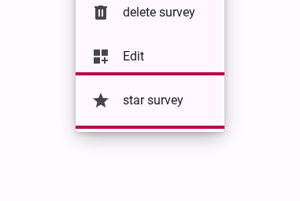

# Marking a survey as favorite

If you have many surveys in your workspace, you can mark the most important ones as "favorites" to ensure they are always easy to find.

Marking a survey as a favorite adds it at the top of the list of surveys in your workspace. This is useful for quickly accessing the surveys you are currently working on or need to reference frequently.

## Step 1: Open the survey context menu

From your survey workspace, locate the survey you wish to mark as a favorite. Right-click on the survey row to open the context menu.

<figure>
  
  <figcaption>Right click survey and select star survey</figcaption>
</figure>

Select **star survey**.

Once marked as a favorite, a star icon will appear next to the survey name, and you can easily filter your workspace to show only your starred surveys.
