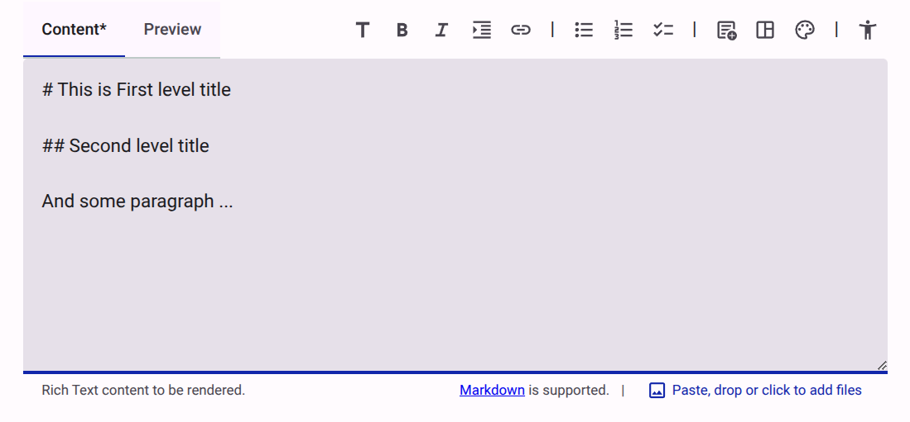
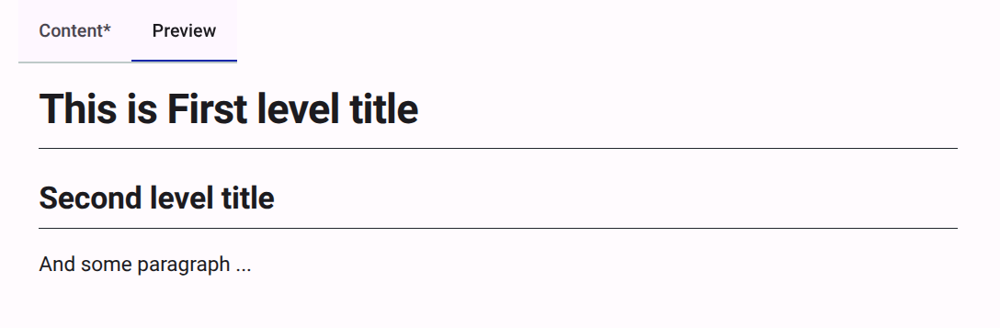

# Providing Rich Formatting

Accessible Surveys uses **Markdown** to allow you to add rich formatting to your questions, descriptions, and messages. This ensures that your content is both visually appealing and structurally accessible.

## Step 1: Use the Content Editor

**Text content** is a fundamental item of a survey, that allow to provide rich formatting like headings, bold and italic text, lists, links, and more.

To add text content, follow the [how-to-add-content-to-a-form](./adding-content-to-a-form.md) guide and select `text (markdown)` as the item to add.

Other parts of the survey, like the `Introduction` or the `Thank You` page provides a rich-text (markdown) editor by default.

Once added, you can format your text in two ways:

1. **Using the Toolbar**: Use the icons at the top of the editor to quickly apply formatting like Bold (**B**), Italic (*I*), Links, and Lists.
2. **Typing Markdown Directly**: You can type Markdown syntax directly into the editor for faster formatting.

<figure><figcaption>The rich text editor allows you to type Markdown or use the formatting toolbar.</figcaption></figure>

### Common Formatting Options

| Formatting | Markdown Syntax | Result |
| :--- | :--- | :--- |
| **Heading 1** | `# Your Title` | Large primary heading |
| **Heading 2** | `## Your Subtitle` | Secondary heading with a divider |
| **Bold** | `**Text**` | **Bold Text** |
| **Italic** | `*Text*` | *Italic Text* |
| **Lists** | `* Item` or `1. Item` | Bulleted or Numbered lists |


Accessible surveys Markdown also supports writing HTML directly, embedding specialized widgets like the accessibility menu, or using more advanced formatting options, such as blockquotes, code snippets, and tables. For a complete reference on Markdown syntax, see our [Markdown Reference](../reference/content/markdown.md).


## Step 2: Add Images and Files

You can easily add images or other media to your content by:

* Clicking the **Add Files** icon in the toolbar.
* Dragging and dropping files directly into the editor.
* Pasting images from your clipboard.

## Step 3: Preview Your Formatting

To see how your formatting will appear to respondents, click the **Preview** tab at the top of the editor. This provides a real-time rendering of your Markdown content.

<figure><figcaption>Use the Preview tab to see how your content will look to respondents.</figcaption></figure>


For a deeper dive into why we use Markdown, see our [Explanation: Using Markdown](../explanation/using-markdown.md).

