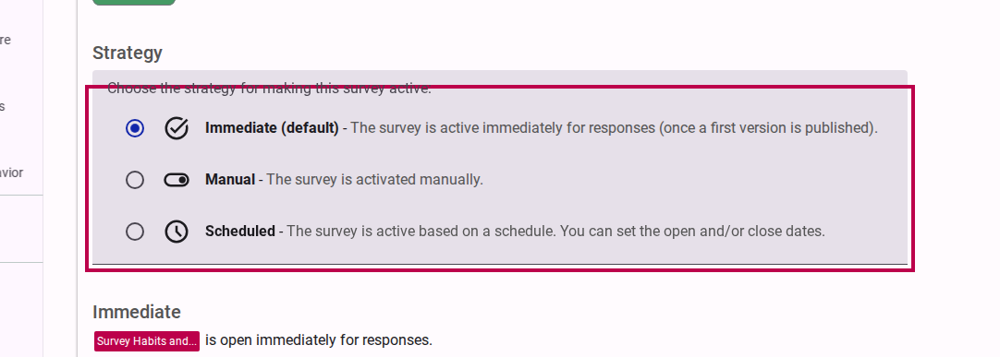
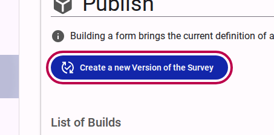
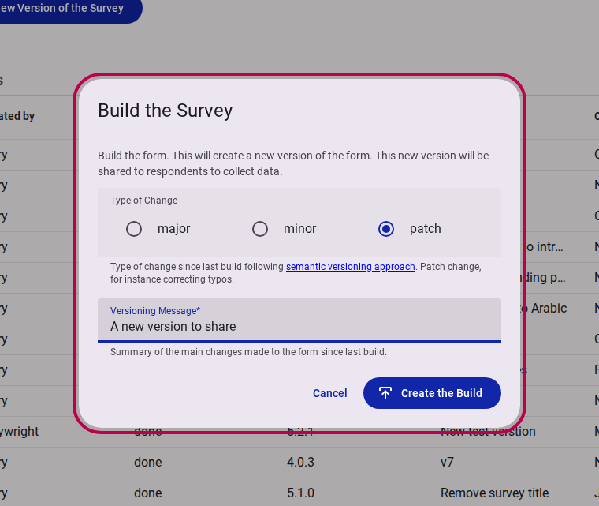
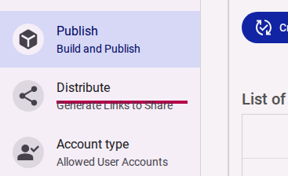
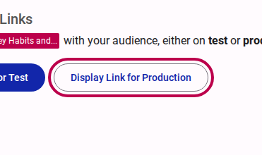
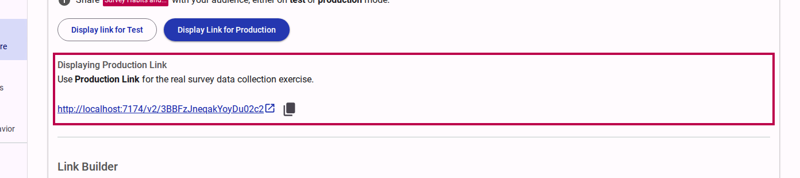
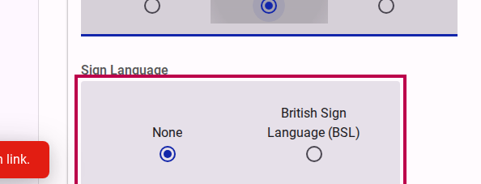
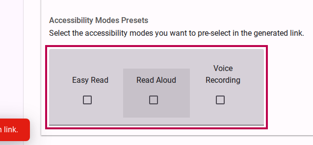

# Publishing a survey


A survey must be 'Published' and active before it can collect responses. If your form has changed, a new version must be built and published before the changes are seen by respondents.


## Step 1: Choose a Publishing Strategy

Before distributing the survey, you can set the strategy for making the survey active (e.g., immediate, manual, or scheduled). This determines when the survey becomes available to respondents.

<figure><figcaption>Select the strategy for making the survey active.</figcaption></figure>

## Step 2: Build a New Version

Before sharing, you must build a version of the form to ensure all recent changes are compiled and ready for production.

1. Navigate to the **Publish** tab.
   <figure><figcaption>Click on the Publish link.</figcaption></figure>

2. Click on the **Create a new Version of the...** button.
   <figure><figcaption>Click the Create a new Version button.</figcaption></figure>

3. You will be prompted to give the version a label (e.g., "A new version to share"). This helps you differentiate between different builds of the survey. Click to build the survey.
   <figure><figcaption>Provide a versioning message and confirm the build.</figcaption></figure>

## Step 3: Generate the Production Link

Once the survey is built, you can generate a shareable link or distribute it directly to your team members or respondents.

1. Go to the **Distribute** section.
   <figure><figcaption>Navigate to the Distribute section.</figcaption></figure>

2. Click on **Display Link for Production**. This link will collect real survey data.
   <figure><figcaption>Click the Display Link for Production button.</figcaption></figure>

3. A dialog will display the production link.
   <figure><figcaption>The production link is generated and displayed.</figcaption></figure>

## Step 4: Preselect Options (Optional)

When generating the link, you have the option to preconfigure certain settings so the respondent gets a tailored experience immediately upon opening the link.

- **Select a language:**
  <figure><figcaption>Preselect the default language for the survey link.</figcaption></figure>

- **Select a sign language:**
  <figure><figcaption>Preselect the default sign language.</figcaption></figure>

- **Select accessibility modes:**
  <figure><figcaption>Preselect specific accessibility modes like Read Aloud or Easy Read.</figcaption></figure>

## Step 5: Copy the Link to Share

Once you have configured the desired options, copy the generated link and distribute it to your audience.

<figure><figcaption>Copy the final production link and share it.</figcaption></figure>
