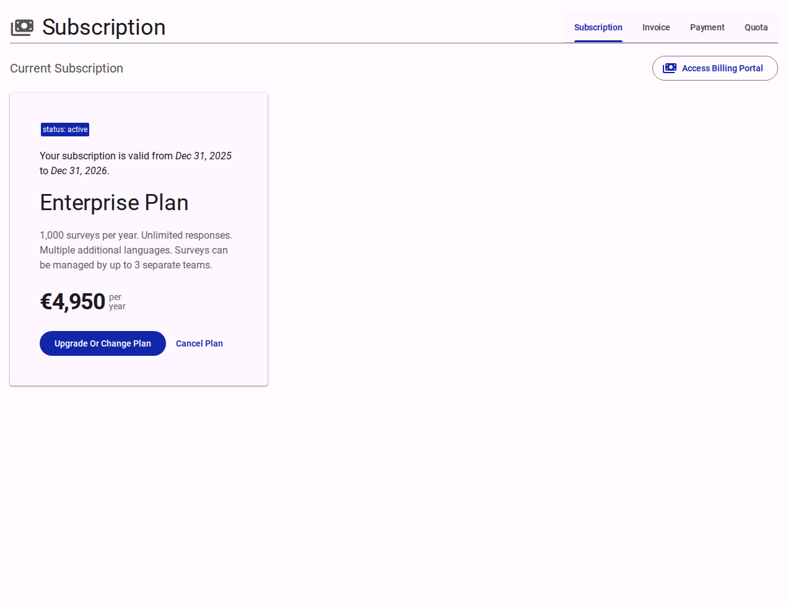
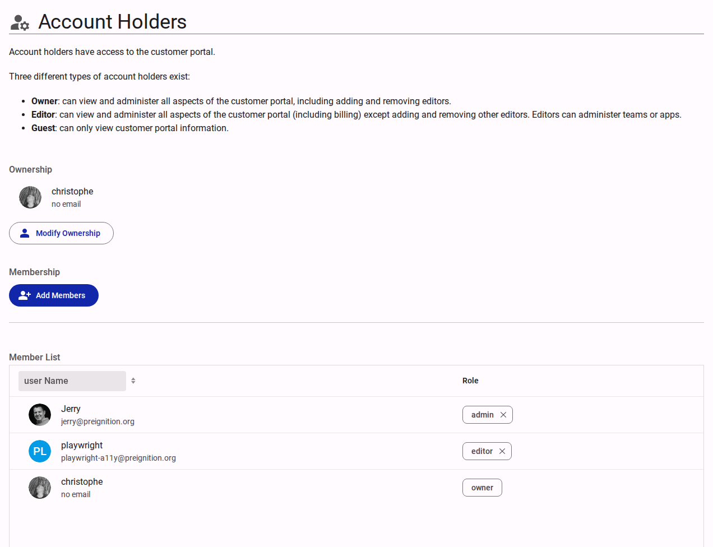
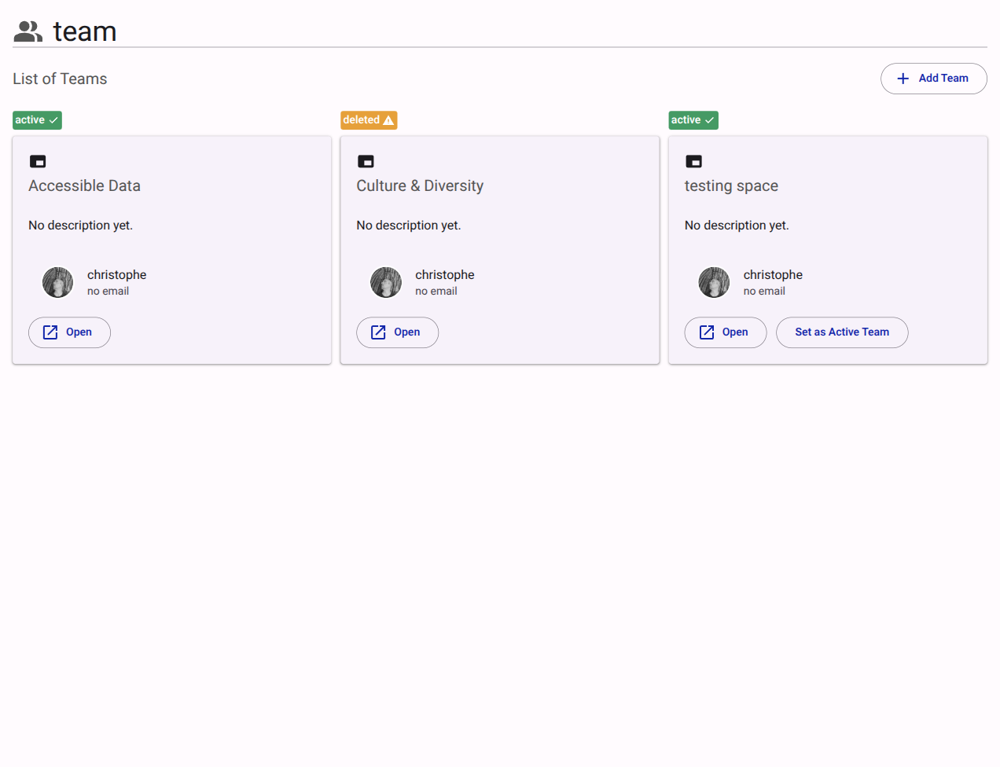

# Managing Customer Settings

The Customer Portal provides a central place to manage your profile, subscriptions, team members, and the look and feel of your applications. This guide will walk you through the various settings available to you as an account holder.

## Accessing the Customer Portal

When you log into the customer application, you are directed to the **Customer Portal**. The portal is organized into multiple tabs accessible from the side menu, grouping related settings together.

> [!NOTE]
> Some settings are only available to users with the **Owner** or **Admin** roles. If you are an **Editor** or **Guest**, certain tabs or advanced actions will be hidden or restricted.

## Profile Settings

The **Profile** section is where you manage your core account details. It is divided into two tabs: **Public** and **Private**.

<figure><figcaption>The Profile tab allows you to configure public settings and language preferences.</figcaption></figure>

1. Navigate to the **Profile** tab in the Customer Portal.
2. Under the **Public** settings, you can manage the name of the customer and your default language.
3. **Languages**: You can toggle specific languages (e.g., Chinese, Ukrainian, Swahili) to make them available for Teams to use in their resources (like forms or questions).
4. Under the **Private** settings tab, you can securely update your contact email and phone number.

> [!IMPORTANT]
> Only the account Owner can view and edit the Private settings tab.

## Managing Subscriptions and Billing

All billing actions are securely managed through Stripe.

<figure><figcaption>View and manage your current subscription plan and billing portal.</figcaption></figure>

1. Click on the **Subscription** tab.
2. Here, you can view your **Current Subscription** plan card (e.g., Enterprise Plan), which details your quotas (like the number of surveys per year) and your yearly or monthly cost.
3. You can click **Upgrade Or Change Plan** or **Cancel Plan** directly from this view.
4. To view invoices or update payment methods, click the **Access Billing Portal** button.
5. The sub-tabs at the top right allow you to switch between **Subscription**, **Invoice**, **Payment**, and **Quota** views.

## Managing Account Holders (Members)

The **Account Holders** tab allows you to add or remove access for users within your customer account.

<figure><figcaption>Manage ownership and member roles for the customer portal.</figcaption></figure>

There are different types of account holders:
- **Owner**: Can view and administer all aspects of the customer portal, including adding/removing other editors.
- **Editor**: Can view and administer all aspects except adding/removing editors. Can administer teams and apps.
- **Guest**: Can only view customer portal information.

**To manage members:**
1. Navigate to **Account Holders**.
2. Under **Ownership**, you can click **Modify Ownership** to transfer the Owner role.
3. Under **Membership**, click **Add Members** to invite new users.
4. The **Member List** displays all current users and their roles. You can adjust their role (e.g., admin, editor, owner) or remove them using this list.

## Managing Teams

The **Teams** tab allows you to organize your users and assets into dedicated workspaces.

<figure><figcaption>View and manage your active and deleted teams.</figcaption></figure>

1. Navigate to the **Teams** tab to view a list of all current teams represented as cards (e.g., "Accessible Data", "testing space").
2. Cards display the team's status badge (like `active` or `deleted`).
3. Click **Add Team** at the top right to establish a new group.
4. For existing teams, you can click **Open** to access that specific team's portal, or **Set as Active Team** to switch your current context to that team.

## Customizing Your Theme

The **Theme** section lets you personalize the look and feel of your environment. 

<figure><figcaption>Configure colors, typography, and layout for your application theme.</figcaption></figure>

1. Navigate to the **Theme** tab.
2. Under **General**, you can name your theme, provide a description, and toggle whether it is currently **Active**.
3. Under **Theme Colors**, you can set a **Seed Color** (e.g., `#000000`) and adjust the **Contrast Level** using the slider to automatically derive related colors.
4. You can fine-tune specific **Primary Colors** for both light and dark modes to ensure accessibility and consistent branding across your applications.

## Managing Storage Locations

For organizations with specific data sovereignty requirements:
1. Navigate to **Storage Locations**.
2. Select where your respondent data should be securely stored. 

## Apps and Referrals

- **Apps**: From the Apps tab, you can view available features and activate or deactivate them for your customer account. Note that adding new apps may affect your subscription quotas.
- **Referral**: Use the Referral tab to refer other organizations to the platform and earn rewards or discounts.

## Danger Zone

> [!WARNING]
> This section is strictly for advanced and irreversible actions.

The **Danger Zone** is restricted to **Owners** and **Admins**. It provides options to pause, cancel, or permanently delete the customer account and its associated data. Please proceed with caution when navigating this section.
