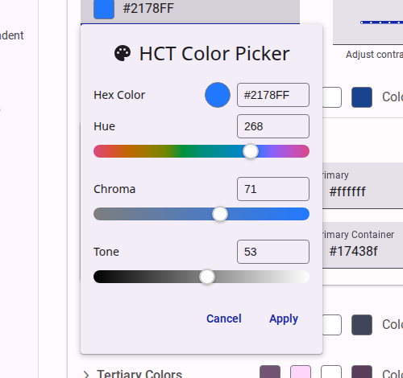

# The Color System

When creating and customizing themes for your surveys, the platform leverages the Material Design 3 color system and the HCT color space to ensure beautiful, accessible, and harmonious color palettes.

## The HCT Color Space

HCT stands for Hue, Chroma, and Tone. It is a color space that provides a more accurate representation of colors compared to other color spaces (CAM16 or CIELAB).

- **Hue:** The type of color (e.g., red, blue, green).
- **Chroma:** The colorfulness or intensity of the color (how neutral or vibrant it is).
- **Tone:** The lightness or darkness of the color.

The major advantage of the HCT color space is that the "Tone" value directly corresponds to human perception of lightness. This allows the system to guarantee contrast ratios for accessibility just by measuring the mathematical difference between the Tone values of two colors, regardless of their Hue or Chroma.

In our platform, we utilize a custom component for selecting colors in the `HCT` color space, which provides a specialized HCT color picker. This allows you to fine-tune the Hue and Chroma of your brand colors while the system automatically calculates and checks Tone values to maintain WCAG AA contrast requirements.

<figure>
  
  <figcaption>Use the color picker for precise color selection.</figcaption>
</figure>

For more details on the science behind HCT, you can read [The Science of Color & Design](https://m3.material.io/blog/science-of-color-design) on the Material Design Blog.

## Material Design 3 Color System

Our theme engine is built on top of the Material Design 3 (M3) color system. The M3 system is dynamic and structured around several key semantic color roles, which are generated from a single "seed color" or defined explicitly.

### Key Color Roles

- **Primary:** The main brand color used for prominent active elements like primary buttons and active states.
- **Secondary:** Used for less prominent components, providing more muted accents in the UI.
- **Tertiary:** Used for contrasting accents that can balance the primary and secondary colors or bring heightened attention to an element.
- **Error:** Used to indicate errors and critical warnings.
- **Surface:** The background colors for the survey and its structural elements (e.g., cards, dialogs, pages).
- **On-Colors:** Every role has a corresponding "On" color (e.g., `onSurface`, `onPrimary`). These are used for text and icons that sit *on top of* the base color, ensuring they remain legible and accessible.

When you select a "seed color" in the theme editor, the system uses the HCT color space algorithms to generate a complete tonal palette for all these roles. This ensures that the generated colors are cohesive and automatically meet contrast requirements against their respective backgrounds.

To learn more about how these roles interact, refer to the [Material Design 3 Color System Documentation](https://m3.material.io/styles/color/system/how-the-system-works).
