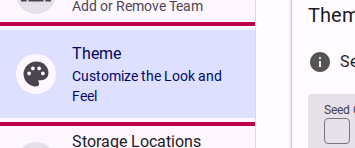
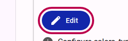
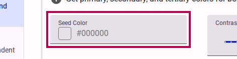
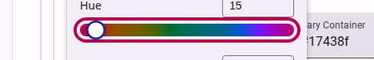
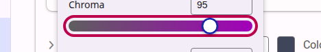
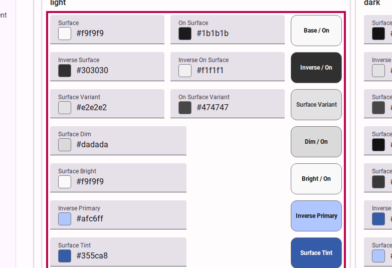
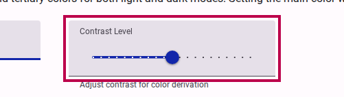
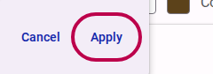
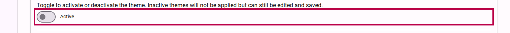
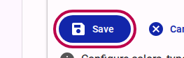

# How to create a theme

Creating a custom theme allows you to define specific colors, typography, and layout settings that can be reused across all your surveys. This ensures brand consistency and provides an easy way to customize the user interface.

> [!TIP]
> If you want to learn more about the science behind our color engine and the semantic roles of each color (Primary, Secondary, Surface, etc.), please read our [Explanation of the Color System](../explanation/color-system.md).

## Step 1: Edit Theme Settings

Navigate to your customer organization settings and select the option to manage themes.

<figure>
  
  <figcaption>Select the theme settings option from the navigation menu.</figcaption>
</figure>

Click on the button to add or edit a theme.

<figure>
  
  <figcaption>Navigate to the theme editor to begin customizing.</figcaption>
</figure>

## Step 2: Choose a Seed Color

The easiest way to start is by selecting a base "seed color" for your brand. This primary color will be used to automatically generate a harmonious color palette for your theme.

<figure>
  
  <figcaption>Select your primary brand color to generate a palette.</figcaption>
</figure>

You can use the color picker to select the exact hue you need. The system will automatically ensure that the generated colors meet WCAG AA contrast requirements.

<figure>
  
  <figcaption>Use the color picker for precise color selection.</figcaption>
</figure>

## Step 3: Customize Theme Colors

Once your initial palette is generated, you can fine-tune specific color assignments to match your exact brand requirements.

<figure>
  
  <figcaption>Review and adjust the generated theme colors.</figcaption>
</figure>

You can adjust properties like hue and chroma (color intensity) using the provided sliders.

<figure>
  
  <figcaption>Fine-tune the color hue.</figcaption>
</figure>
<figure>
  
  <figcaption>Adjust the color intensity (chroma).</figcaption>
</figure>

You can also explicitly define surface colors and background contrasts. Expanding the surface colors section gives you full control over the background elements of your surveys.

<figure>
  
  <figcaption>Configure surface colors.</figcaption>
</figure>
<figure>
  
  <figcaption>Expand for detailed surface color control.</figcaption>
</figure>

## Step 4: Review Contrast Settings

Accessibility is a key part of custom themes. The editor provides built-in contrast checking to ensure your text (`onSurface`) remains legible against your background (`surface`) colors.

<figure>
  
  <figcaption>Review contrast settings to ensure accessibility compliance.</figcaption>
</figure>

> [!WARNING]
> The editor will display warnings if your chosen color combinations fall below the minimum 3:1 contrast ratio required for WCAG AA compliance.

## Step 5: Save and Activate

After reviewing your color applications and ensuring your theme looks correct across different elements, save your changes.

<figure>
  
  <figcaption>Apply your finalized color selections.</figcaption>
</figure>

<figure>
  
  <figcaption>Set the theme as active.</figcaption>
</figure>

Finally, click the **Save** button to store your new theme. It will now be available to select when creating or editing surveys.

<figure>
  
  <figcaption>Save your theme so it can be applied to surveys.</figcaption>
</figure>
