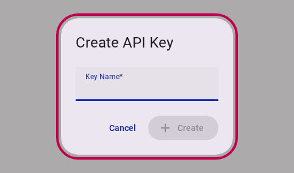

# How to Manage Team API Keys

Team API keys allow external services, scripts, and data pipelines to authenticate with Accessible Data on behalf of your team without exposing personal user credentials.

> [!IMPORTANT]
> API key secrets are displayed **exactly once** upon creation. Make sure to copy and securely store your key secret immediately.

This guide walks you through creating a new API key and revoking an existing key when it is no longer needed.

> [!NOTE]
> The API Keys panel is only visible to team owners and admins.

---

## Part 1: Adding a New API Key

### Step 1: Open the API Keys Panel

In the Customer Portal, navigate to **Team Settings** for your team and select **API Keys** from the navigation menu.

<figure>
  
  <figcaption>The API Keys panel displays existing keys and the button to generate a new key.</figcaption>
</figure>

Click the **Create API Key** button in the top right of the panel.

### Step 2: Open the Create API Key Dialog

A dialog will appear prompting you for details to identify the new key.

<figure>
  
  <figcaption>The Create API Key dialog prompts for a descriptive key name.</figcaption>
</figure>

### Step 3: Enter a Key Name

Enter a descriptive name for the API key (for example, `Data pipeline` or `Analytics Integration`) so team members can easily identify its purpose.

<figure>
  
  <figcaption>Give your API key a recognizable name corresponding to its integration.</figcaption>
</figure>

### Step 4: Copy and Save the Secret

Click **Create**. The generated secret key will be displayed **exactly once** and automatically copied to your clipboard.

<figure>
  
  <figcaption>The secret key is revealed once and auto-copied to the clipboard.</figcaption>
</figure>

::: warning
Store the secret key in a password manager or secure vault immediately. Once closed, the raw key secret cannot be viewed or retrieved again.
:::

### Step 5: View the New Key in the List

Click **Close**. Your newly created key will now appear in the list with its name, prefix ID, and creation date.

<figure>
  
  <figcaption>The new API key is listed under Team Settings.</figcaption>
</figure>

---

## Part 2: Revoking an API Key

If an API key is compromised, or an integration is retired, you can revoke it immediately.

### Step 1: Locate the Key to Revoke

In the **API Keys** panel, find the key you wish to remove and click the **Revoke** button in its row.

<figure>
  
  <figcaption>Each listed API key includes a Revoke action button.</figcaption>
</figure>

### Step 2: Confirm Revocation

A confirmation dialog will open warning that any system using the key will lose access immediately.

<figure>
  
  <figcaption>Review the key details in the confirmation dialog before revoking.</figcaption>
</figure>

### Step 3: Complete Revocation

Click **Revoke**. The system will process the revocation request in real time and remove the key from your active key list.

<figure>
  
  <figcaption>Confirming revocation immediately invalidates the key.</figcaption>
</figure>

---

## Related Content

- [Team Settings Reference](../reference/team/index.md)
- [Interactive API Reference](/api.html)
- [How-to Guides Index](./index.md)
