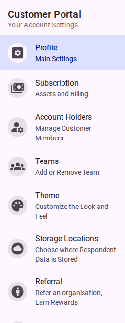

# Customer Settings

This section provides technical and descriptive information about the configuration options available within the Customer Portal.

<figure><figcaption>The Customer Portal navigation menu.</figcaption></figure>

- [Profile Settings](./profile.md)
- [Subscription Settings](./subscription.md)
- [Account Holders (Members)](./members.md)
- [Teams](./teams.md)
- [Theme](./theme.md)
- [Storage Locations](./storage-locations.md)
- [Apps and Referrals](./apps-referrals.md)
- [Danger Zone](./danger-zone.md)
