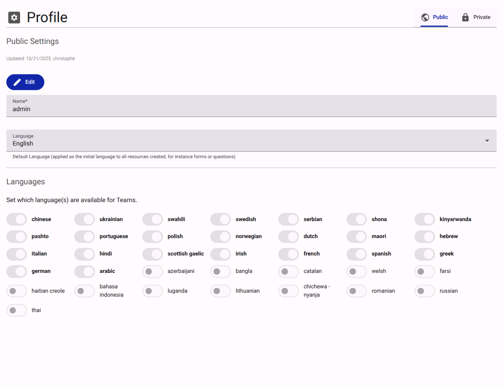

# Profile Settings

The Profile section manages core account details. It is divided into two tabs: **Public** and **Private**.

<figure><figcaption>Profile settings interface.</figcaption></figure>

## Public Settings

- **Name**: The display name of the customer organization.
- **Language**: The default language applied to newly created resources.
- **Languages**: A toggleable list of available languages (e.g., Chinese, Ukrainian, Swahili). Enabling a language makes it available for Teams to use in their resources (like forms or questions).

## Private Settings

- **Email**: Contact email address.
- **Phone**: Contact phone number.

> [!IMPORTANT]
> The Private settings tab is only visible and editable by the account Owner.
