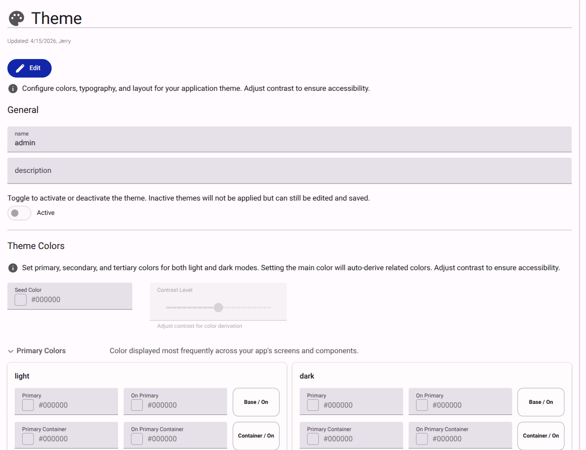

# Theme

The Theme section controls global branding elements across activated apps.

<figure><figcaption>Theme configuration interface.</figcaption></figure>

## General Settings

- **Name**: Identifier for the theme.
- **Description**: Details about the theme's purpose.
- **Active**: Determines if the theme is currently applied to the applications.

## Theme Colors

- **Seed Color**: The base hex color code (e.g., `#000000`) used to automatically generate a cohesive color palette.
- **Contrast Level**: Slider to adjust the contrast of derived colors for accessibility.
- **Primary Colors**: Explicit color definitions for `light` and `dark` modes.
