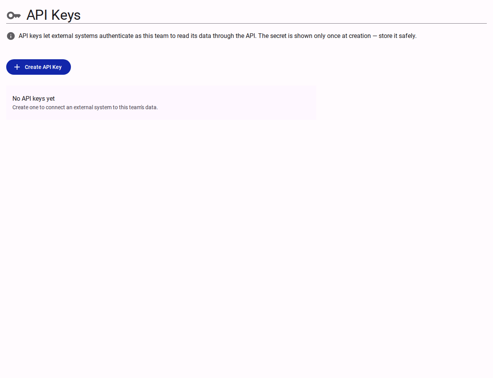

# Team API Keys

The **API Keys** panel under Team Settings allows team administrators to generate, list, and revoke credentials used for programmatic integration with Accessible Data APIs. The panel is only visible to team owners and admins.

<figure><figcaption>The API Keys management panel in Team Settings.</figcaption></figure>

## Key Concepts

- **Cryptographic Security:** API keys are generated using cryptographically secure random bytes on the server.
- **Single Secret Reveal:** The plain-text secret is displayed to the user **exactly once** upon creation and automatically copied to the clipboard. The plain-text secret is never saved or retrievable again.
- **Metadata Storage:** The system stores only non-sensitive key metadata: key `$id`, user-provided `name`, key prefix, and creation timestamp.
- **Immediate Revocation:** Revoking an API key removes its backend trigger, instantly cutting off authorization for any requests carrying that key.

## Operations

| Action | Description | Dialog / UX Behavior |
| :--- | :--- | :--- |
| **Create API Key** | Generates a new API key for a team | Modal dialog collecting key name; presents secret key once with copy-to-clipboard |
| **Revoke API Key** | Immediately deactivates an existing key | Confirmation dialog with real-time process progress indicator |

## Related Content

- [How to Manage API Keys](../../how-to/manage-api-keys.md)
- [Interactive API Reference](/api.html)
