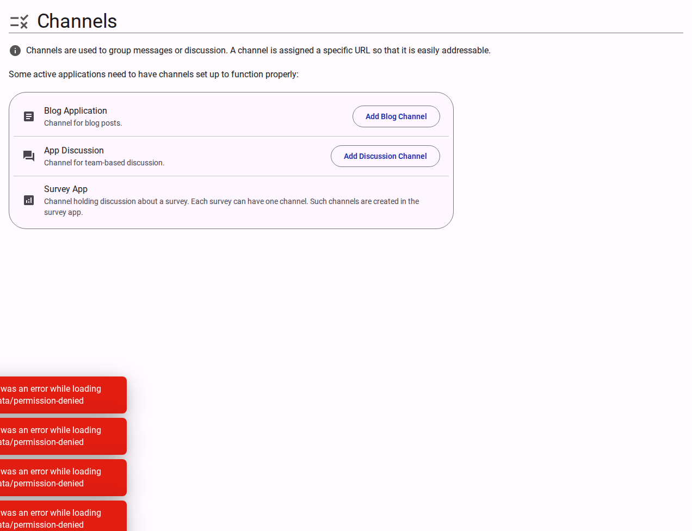

# Channels

The Channels section manages application-specific communication streams and URLs for the team. 

Channels are used to group messages or discussions and are assigned specific URLs to make them addressable. Certain active applications require channels to function correctly.

<figure><figcaption>Team channels management interface.</figcaption></figure>

## Available Applications

- **Blog Application**: Channels for organizing and discussing blog posts.
  - **Add Blog Channel**: Action to provision a new blog channel.
- **App Discussion**: Channels for internal, team-based discussions.
  - **Add Discussion Channel**: Action to provision a new discussion stream.
- **Survey App**: Channels for holding discussions about specific surveys. These are typically created automatically within the survey application itself.
