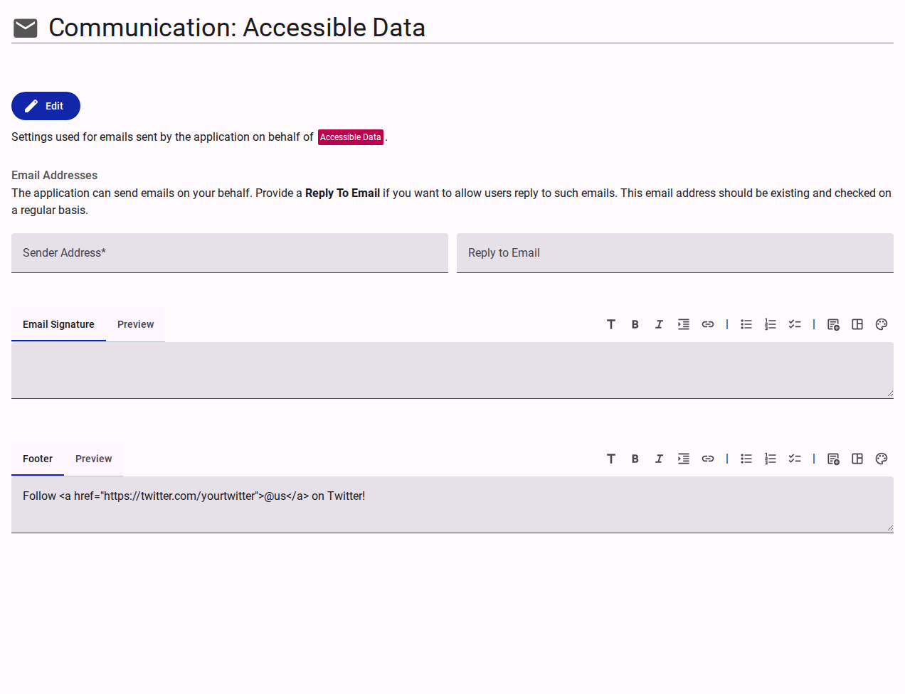

# Communication Settings

The Communication section configures the default settings for automated emails sent by the application on behalf of the team.

<figure><figcaption>Team communication settings interface.</figcaption></figure>

## Email Addresses

- **Sender Address**: The primary email address from which automated team emails originate.
- **Reply to Email**: An optional monitored inbox where respondents can direct their replies.

## Email Formatting

- **Email Signature**: A rich-text editor to define a standardized signature appended to outgoing communications.
- **Footer**: A rich-text editor to define persistent footer content, such as social media links or regulatory disclaimers, appended to all emails.
