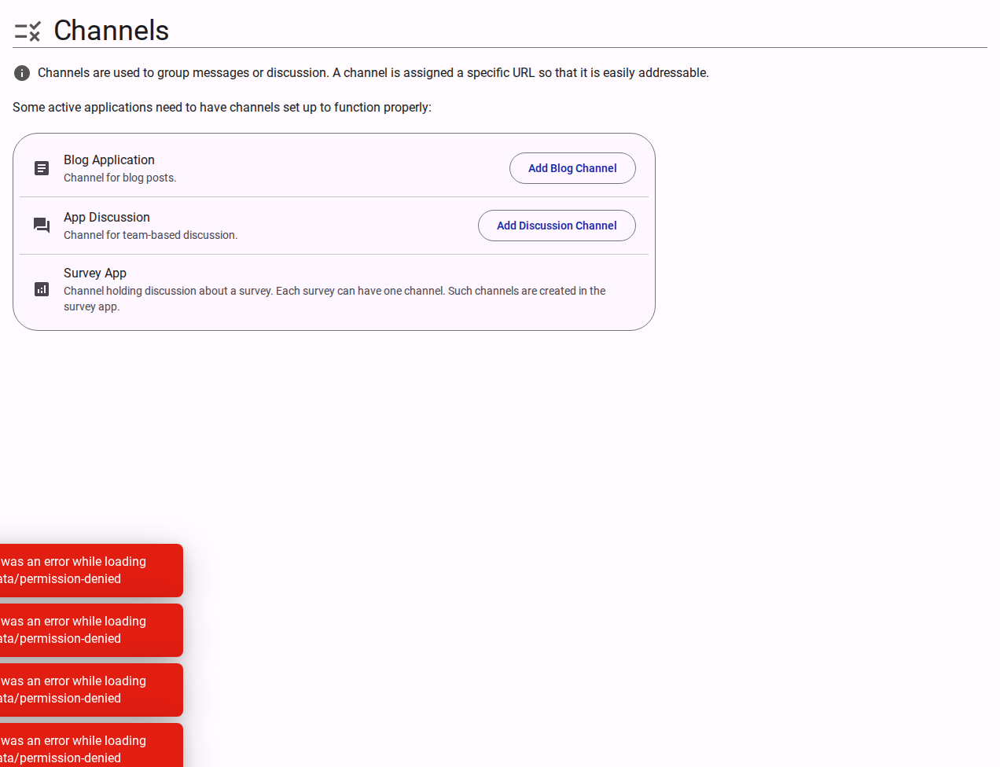

# Danger Zone

The Danger Zone contains advanced, destructive administrative actions for the team.

<figure><figcaption>Team danger zone actions.</figcaption></figure>

> [!WARNING]
> Actions in this section are irreversible and restrict access to the team's data.

## Available Actions

- **Delete Team**: Permanently removes the team and its associated configurations. Depending on customer settings, underlying data may be retained or purged.
