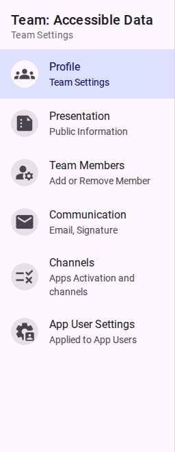

# Team Settings

This section provides technical and descriptive information about the configuration options available within a Team's workspace in the Customer Portal.

<figure><figcaption>The Team Settings navigation menu.</figcaption></figure>

- [Profile Settings](./profile.md)
- [Presentation Settings](./presentation.md)
- [Team Members](./members.md)
- [Communication Settings](./communication.md)
- [Channels](./channels.md)
- [Danger Zone](./danger-zone.md)
