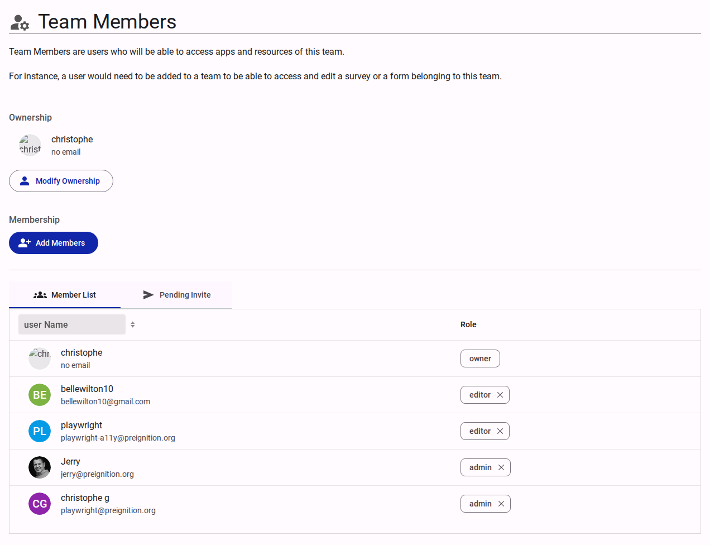

# Team Members

The Team Members section defines access roles for users interacting with the team's resources (e.g., surveys, forms).

<figure><figcaption>Team members interface.</figcaption></figure>

## Ownership

Displays the current owner of the team.

- **Modify Ownership**: Action to transfer the Owner role to another user.

## Membership Management

- **Add Members**: Interface to invite new users to the team and assign them roles.
- **Views**:
  - **Member List**: Displays current members, their email addresses, and their assigned roles (e.g., `owner`, `admin`, `editor`). Roles can be adjusted or revoked directly from this list.
  - **Pending Invite**: Displays invitations that have been sent but not yet accepted.
