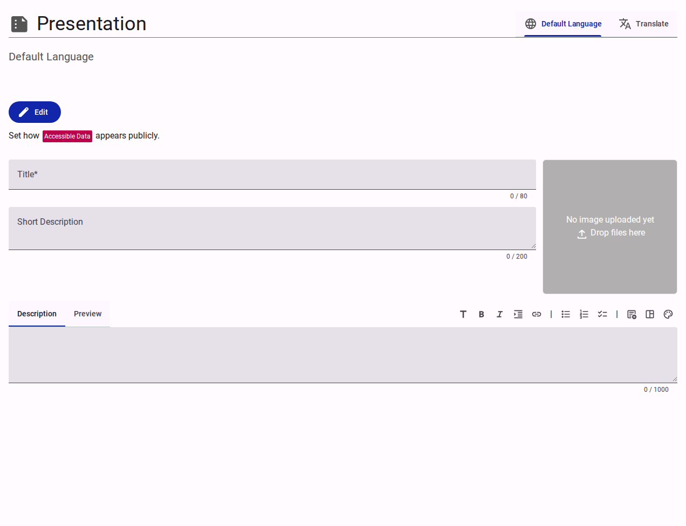

# Presentation Settings

The Presentation section manages the public-facing details and localization of the team's identity.

<figure><figcaption>Team presentation settings interface.</figcaption></figure>

## Language Controls

- **Default Language**: Defines the primary language for the team's public profile.
- **Translate**: Allows configuring the presentation details in additional languages.

## Public Information Fields

- **Title**: The formalized, public-facing name of the team.
- **Short Description**: A concise summary of the team's purpose (max 200 characters).
- **Description / Preview**: A rich-text editor for providing a detailed, formatted description of the team.
- **Image Upload**: An area to upload a team logo or banner image via drag-and-drop.
