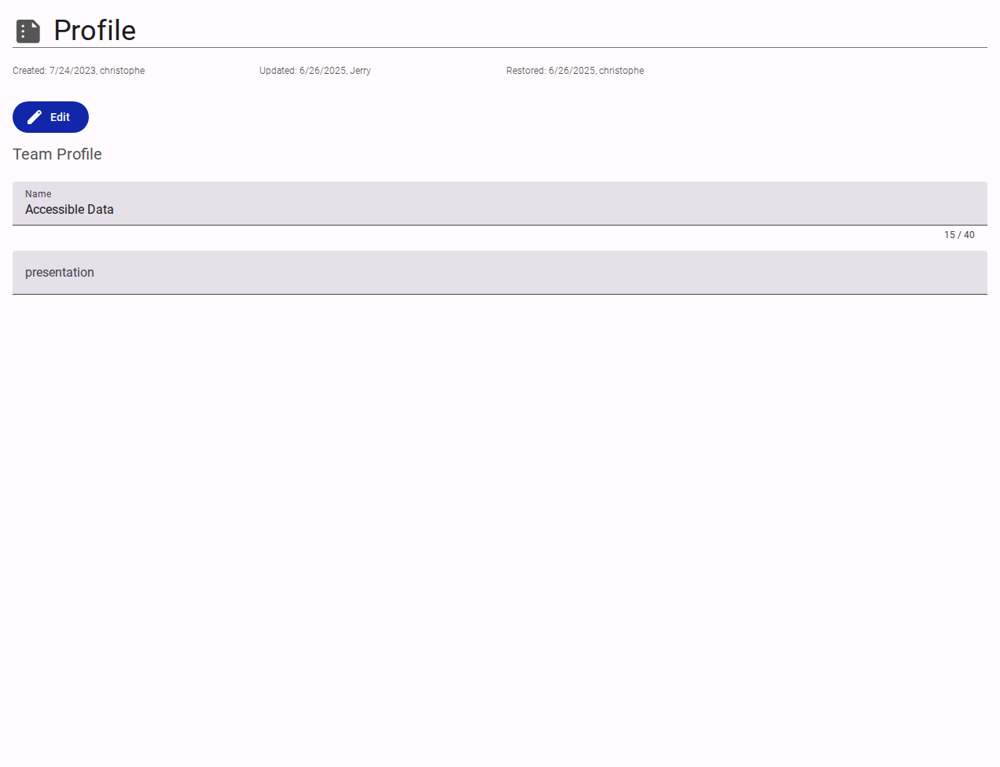

# Profile Settings

The Profile section manages the core identity and administrative metadata for a team.

<figure><figcaption>Team profile settings interface.</figcaption></figure>

## Interface Elements

- **Metadata Header**: Displays `Created`, `Updated`, and `Restored` timestamps along with the user who performed the actions.
- **Edit Button**: Enables modification of the profile fields.
- **Name**: The display name of the team (e.g., "Accessible Data").
- **Presentation**: A brief, unformatted text field intended for internal notes or a summary description of the team.
